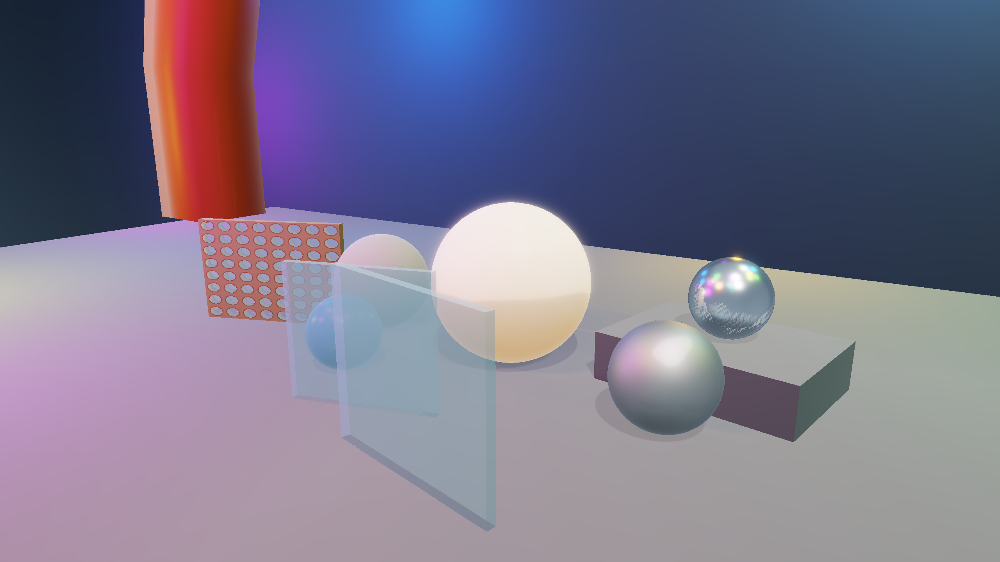

# VulkanEngine

VulkanEngine is a C++20 Vulkan 1.3 real-time renderer prototype focused on explicit GPU resource management, modern rendering architecture, GPU-driven visibility, profiling, post-processing, and lightweight editor/data workflows. It is a renderer portfolio project, not a full game engine.

The demo renders a static glTF test scene, or a built-in cube fallback, through SDL3, Volk, Vulkan Memory Allocator, Dynamic Rendering, and Synchronization2. This is intentionally an engine-style renderer portfolio project rather than a full game engine: the code favors readable Vulkan ownership, clear resource contracts, and small milestones over a large framework.

## Feature List

- Vulkan 1.3 initialization with Volk, validation in Debug, Dynamic Rendering, and Synchronization2.
- VMA-backed buffers and images, Buffer Device Address, CPU-visible uploads/readbacks, and GPU-local staging copies.
- SDL3 window and surface integration with swapchain recreation support.
- Static mesh path for built-in cube geometry and static glTF triangle meshes.
- glTF material factors plus base color, normal, and metallic-roughness texture loading.
- Minimal path-based `AssetManager` for material JSON assets and texture path metadata.
- Material asset JSON load/save for PBR scalar fields, texture path metadata, alpha metadata, and portfolio materials.
- Tangent-space normal mapping and Cook-Torrance GGX direct lighting.
- Optional HDR environment loading with a procedural fallback, cubemap-based skybox/IBL resources, diffuse irradiance, GGX prefiltered specular IBL, and split-sum BRDF LUT.
- Skybox and mesh shaders output HDR linear color into an offscreen scene color target before post-processing.
- Bloom extraction, legacy separable blur fallback, mip-chain bloom, and final composite passes are implemented.
- Optional Temporal AA foundation, disabled by default, with Halton subpixel jitter, ping-pong HDR history, conservative neighborhood clamping, and explicit history reset/debug controls.
- Auto exposure from HDR scene luminance builds log-average and histogram data, reduces exposure into GPU exposure state for composite, and keeps frame-latency CPU exposure readback only for debug display.
- Manual exposure remains available as the fallback path.
- Reinhard/ACES tone mapping is applied in the final composite pass before swapchain output.
- Dear ImGui debug overlay exposes runtime render settings, persistent JSON settings save/load/reset controls, render graph visualization, GPU profiler/frame timeline history, culling/exposure history plots, editable scene hierarchy/transform controls, editable material scalar controls, and render-target/CSM cascade debug views.
- Compact Kulla-Conty-style multi-scattering compensation for PBR response.
- PCF-filtered cascaded shadow maps (CSM) with basic texel snapping, optional cascade debug tinting, per-cascade GPU shadow-caster culling, and an indirect shadow draw path.
- Descriptor indexing path for bindless material texture arrays, with a legacy descriptor-set fallback.
- Render Graph 2.0 with logical texture/buffer handles, pass read/write declarations, conservative automatic image transitions, selected buffer barrier inference, transient render-target descriptions, basic pass liveness/culling metadata, and ImGui pass/resource visualization.
- GPU frustum culling compute pass that compacts visible indirect draw commands, writes per-batch visible counts, and can optionally run conservative previous-frame Hi-Z occlusion tests. Occlusion culling is disabled by default.
- Multi-draw indirect batching by mesh-compatible ranges on the bindless main path and shadow path.
- GPU timestamp profiler with per-pass timings, frame-latency readback, moving-average ImGui history, and debug labels for capture/profiling orientation.
- Editable scene workflow for runtime object transforms, visibility, camera/light settings, and JSON scene save/load.
- Portfolio screenshot capture mode with F12 PNG export from the final tonemapped swapchain image before the ImGui overlay.

## Engineering Focus

- Explicit graphics API design: Vulkan 1.3 object ownership, Dynamic Rendering, Synchronization2, descriptor contracts, and swapchain recreation.
- GPU-driven rendering steps: indirect draws, bindless material textures, GPU frustum culling, optional conservative Hi-Z occlusion, and per-pass GPU timing.
- Synchronization and resource lifetime: graph-managed image transitions and selected buffer barriers, explicit readback/intra-pass barriers, frame-latency readbacks, and RAII Vulkan wrappers.
- Debugging/profiling infrastructure: ImGui panels for render graph resources, timestamp scopes, render targets, culling, exposure, materials, and scene metadata.
- Data-driven material workflow: JSON material assets mapped into runtime PBR state without claiming a full editor or asset pipeline.

## Architecture Overview

- `Application` owns the `Window` and `Renderer`.
- `Window` owns SDL initialization, the native window, Vulkan instance extensions, and surface creation.
- `Renderer` owns the frame loop, scene data, frame resources, draw-item construction, and pass orchestration.
- `VulkanContext` owns the instance, debug messenger, surface, selected physical/logical device, queues, and VMA allocator.
- `VulkanDevice` selects a Vulkan 1.3 GPU, enables required/optional features, and logs descriptor indexing plus indirect-count capabilities.
- `VulkanSwapchain`, `VulkanCommandContext`, and `VulkanSync` own frame presentation, command buffers, semaphores, and fences.
- `VulkanPipeline` and `VulkanComputePipeline` load CMake-built SPIR-V and create graphics/compute pipeline layouts and pipelines.
- `VulkanBuffer`, `VulkanImage`, `VulkanTexture`, `VulkanEnvironmentMap`, `VulkanBrdfLut`, and `VulkanShadowMap` wrap Vulkan resource lifetime.
- `Mesh`, `Material`, `RenderObject`, `DrawItem`, `Transform`, and `Camera` provide renderer-side scene abstractions without ECS.
- `RuntimeSettings` stores the debug UI's persistent render settings and serializes them as local JSON under `config/`.
- `AssetManager` stores stable path-based material/texture metadata, loads/saves material JSON files, and leaves Vulkan texture ownership in `Renderer`/`VulkanTexture`.
- The editable scene workflow stores runtime object IDs, names, visibility, transforms, camera settings, and directional-light settings as JSON under `assets/scenes/`.
- `ImGuiLayer` owns the Dear ImGui context, SDL3 backend, Vulkan backend, and ImGui descriptor pool.
- `RenderGraph` tracks logical texture/buffer resources for `CSMShadowPass`, `MainHDRPass`, optional `TAAResolvePass`, bloom, `LuminancePass`, `HistogramExposurePass`, `CompositePass`, and `ImGuiPass`, infers conservative image transitions plus selected buffer barriers, and exposes debug pass/resource metadata.
- `GpuProfiler` owns one timestamp query pool per frame-in-flight slot, records named GPU scopes, and exposes completed frame results to the ImGui profiler panel without adding a new frame-loop wait.

## Engine Upgrade Audit

The current repository status is documented in `docs/engine_upgrade_audit.md`. It records the architecture, frame flow, render graph, scene/material/glTF paths, debug UI, culling, post-processing, CSM shadows, profiling infrastructure, and current limitations after the Phase 7 polish pass.

## Documentation

Start with [docs/README.md](docs/README.md) for a short index of the focused technical documents.

For macOS setup, see [docs/build_macos.md](docs/build_macos.md).

## How to Demo

1. Build shaders with `cmake --build build --config Debug --target VulkanEngineShaders`.
2. Build the renderer with `cmake --build build --config Debug --target VulkanEngine`.
3. Run `.\build\Debug\VulkanEngine.exe`.
4. In `VulkanEngine Debug`, open `Debug Views`, then show the `GPU Profiler`, `Render Graph`, `Scene Hierarchy`, and `Material Inspector` panels.
5. Use `Scene Presets` -> `Load Occlusion Test Scene`, then `GPU Culling` -> `Enable Occlusion Test Settings` to inspect conservative Hi-Z culling. Occlusion remains optional and off by default.
6. Toggle `Temporal AA` off and on from its panel. TAA is a foundation pass and is disabled by default.
7. Press `F11` to enable portfolio mode when reviewing the portfolio scene.
8. Press `F12` only when intentionally updating the committed portfolio screenshots.

## Render Graph 2.0

Phase 4 upgrades the previous manual graph into a more engine-like render graph while preserving the renderer's pass order and visual output. The graph now uses `RGTextureHandle` and `RGBufferHandle` declarations, pass-builder read/write declarations, conservative Synchronization2 image transition inference for graph-managed texture resources, selected Synchronization2 buffer barriers for declared buffer pass dependencies, transient descriptions for scene color and bloom targets, imported resources for swapchain/depth/shadow/readback resources, basic pass liveness/culling metadata, and an ImGui panel that lists passes and resources.

Current graph-declared passes are `CSMShadowPass`, `MainGpuCullingPass`, `MainHDRPass`, `DepthPyramidPass`, optional `TAAResolvePass`, legacy bloom extract/blur passes, bloom mip-chain downsample/upsample passes, `LuminancePass`, `HistogramExposurePass`, `CompositePass`, and `ImGuiPass`. The graph now emits conservative buffer barriers for declared dependencies such as main GPU culling outputs consumed by `MainHDRPass`, luminance partials consumed by `HistogramExposurePass`, and exposure state consumed by `CompositePass`. Shadow-culling reset/draw barriers, intra-pass fill/dispatch/copy barriers, host readback visibility, and portfolio screenshot copy barriers remain manual in `Renderer.cpp`.

More details are in `docs/render_graph.md`.

## Post-Processing

The main scene renders to `SceneColorHDR`, an `R16G16B16A16_SFLOAT` full-resolution HDR target. Post-processing samples that target for bloom, exposure, and final composite before the swapchain image is handed to ImGui.

Temporal AA is available as a conservative opt-in pass. When enabled, the renderer jitters the main skybox/mesh projection with an 8-sample Halton sequence, resolves jittered `SceneColorHDR` into one of two full-resolution `R16G16B16A16_SFLOAT` history images, clamps previous history against the current 3x3 neighborhood, and routes bloom, exposure, and composite through the resolved HDR history. TAA is disabled by default and can be reset or tuned from the ImGui `Temporal AA` panel.

Bloom now has a mip-chain path enabled by default. The chain writes persistent half, quarter, eighth, and sixteenth-resolution `R16G16B16A16_SFLOAT` bloom images when the viewport is large enough. The first downsample conservatively thresholds bright HDR samples, lower levels continue filtering the previous level, and the upsample chain progressively combines lower accumulated bloom with each higher local level. The previous half-resolution extract plus separable blur path remains available as a runtime fallback.

Automatic exposure keeps the existing log-average luminance and histogram binning inputs, but `exposure_reduce.comp` now writes exposure, log-average luminance, and histogram-clipped luminance to a GPU-readable exposure state buffer. `CompositePass` reads that buffer directly for auto exposure modes. The CPU reads the small exposure state from a completed frame only for debug UI/history, while manual exposure and portfolio capture still use stable manual exposure.

The composite shader samples the active HDR scene source, the legacy bloom result, the mip-chain bloom result, and exposure state. It chooses the selected bloom method, applies bloom strength, applies manual or GPU exposure, and then runs Reinhard or ACES tone mapping. ImGui exposes bloom enabled/method/mip count/strength/threshold/radius, TAA enable/jitter/clamp/feedback/history state, exposure mode/current debug exposure, and tone mapper selection. Render Graph and GPU profiler panels show TAA, bloom, histogram exposure, and composite metadata/timings.

Current limitations: TAA does not include motion vectors, depth reprojection, disocclusion classification, temporal upscaling, FSR/DLSS/XeSS, reactive masks, local exposure, ray tracing, or automatic camera-cut detection. Details are in `docs/post_processing.md` and `docs/taa.md`.

## Depth Pyramid and GPU Occlusion Culling

Phase 5 adds an optional conservative occlusion layer on top of the existing GPU frustum culling and indirect draw workflow. After `MainHDRPass`, the renderer stores the normal-Z main depth attachment, samples it in `DepthPyramidPass`, and writes an `R32_SFLOAT` max-depth Hi-Z pyramid. The following frame's main GPU culling pass can sample that previous completed pyramid to reject only clearly hidden draw items.

Occlusion is off by default and remains runtime-toggleable in ImGui. The debug UI shows total objects, total draw items, visible-after-culling draw items, frustum-culled draw items, occlusion-culled draw items, occlusion rejection percentage, depth pyramid validity, previous-frame depth validity, mip count, and the current occlusion settings. Conservative fallbacks keep objects visible for invalid/tiny bounds, near-camera objects, near-plane intersections, oversized screen coverage, stale camera/scene state, unavailable sampled depth formats, or missing pyramid resources.

For validation, `VulkanEngine Debug` -> `Scene Presets` includes `Load Occlusion Test Scene`. This procedural scene adds 126 cube objects: a ground plane, five large foreground occluder walls, and 120 smaller static cubes distributed behind them with some edge/top objects left visible. Use `Enable Occlusion Test Settings` in the `GPU Culling` panel, wait one or two frames for previous-frame depth to become valid, then read the `Culling`, `GPU Profiler`, and `Render Graph` panels. The scene is a controlled demo for the existing Hi-Z culling path, not a benchmark. The default glTF/fallback scene may show little or no occlusion rejection because it intentionally has too few draw items and occluders.

This is not a full GPU-built draw-list rewrite, meshlet path, mesh shader path, HLOD system, software rasterizer, or ray tracing feature. Details are in `docs/gpu_culling.md`.

## GPU Profiler

Open the profiler from the ImGui debug overlay:

1. Open `VulkanEngine Debug`.
2. Expand `Debug Views`.
3. Enable `Show GPU Profiler panel`.
4. Expand `GPU Profiler`.

The panel reports GPU profiler availability, total GPU frame time, CPU frame delta, timestamp query usage, and a timing table with current, recent average, max, and history plot values. Results are read back from a completed frame slot after the existing frame fence is signaled, so the profiler does not block the current frame waiting for query results. Timings are GPU timestamp deltas converted with the physical device timestamp period.

Currently profiled ranges include `CSMShadowPass`, per-cascade shadow GPU culling, `MainGpuCullingPass`, `MainHDRPass`, `Skybox`, `RenderObjects`, `DepthPyramid`, optional `TAAResolvePass`, legacy bloom extract/blur, `Bloom Downsample Chain`, `Bloom Upsample Chain`, `LuminancePass`, `Histogram Exposure`, `CompositePass`, and `ImGuiPass`. Nested scopes are shown in execution order; parent scopes include the cost of their children.

## Portfolio Screenshot Capture

The renderer can export a clean portfolio PNG from the final post-tonemapped frame.

1. Build the engine and shaders.
2. Run `VulkanEngine`.
3. Press `F11`, or click `Load Portfolio Showcase Scene` / enable `Portfolio Capture Mode` in `VulkanEngine Debug` -> `Portfolio Capture`.
4. Press `F12` or click `Capture Portfolio Screenshot`. Screenshot requests enable the portfolio showcase first if it is not already active.
5. Use `screenshots/vulkan_engine_portfolio_latest.png`, or the timestamped file beside it, in the portfolio website assets folder.

Portfolio Capture Mode applies a balanced three-quarter camera, ACES tone mapping, stable manual exposure, subtle bloom, CSM settings, and a portfolio-only studio setup with a neutral floor, gradient backdrop, an opaque ceramic hero material, and PBR material samples for matte gray, glossy blue dielectric, rough metal, and small polished metal variation. The normal checker/glTF debug scene remains available while the mode is disabled. Screenshot requests enable and verify the portfolio showcase draw items before readback so `F12` does not export the debug scene. The capture is copied from the swapchain after `CompositePass` and before `ImGuiPass`, so the exported PNG includes tone mapping and bloom but excludes the debug UI.

Reflection note: current reflections are environment-based specular IBL only. The renderer does not currently implement SSR, planar reflections, ray-traced reflections, local reflection probes, or real glass transmission/refraction.



More details are in `docs/portfolio_capture.md`.

## Editable Scene Workflow

The Scene Hierarchy panel now supports a minimal editor-like workflow. It lists runtime `RenderObject` entries by stable object ID and name, lets the selected object edit position, Euler rotation, scale, and visibility, and shows mesh/material/draw-item debug metadata beside the editable fields.

Camera controls expose position, target, up vector, FOV, near plane, far plane, and reset buttons for the default, portfolio, and occlusion-test camera presets. Directional-light controls expose direction, color, intensity, and reset-to-default. Portfolio capture mode keeps its own showcase object transforms/visibility, camera, and lighting presets; F12 and the portfolio showcase button reapply those presets.

Use `Save Scene` and `Load Scene` in the Scene Hierarchy panel to write/read `assets/scenes/default.scene.json`. Save/load restores camera, directional-light settings, object names, visibility, and transforms for the current runtime object list. Simple object material asset paths are restored when they match an already loaded runtime material; mesh references and glTF material-table assignments remain metadata-only. ImGuizmo is deferred because it is not currently vendored in the project.

More details are in `docs/scene_editing.md`.

## Asset Manager and Material Assets

Phase 3 adds a minimal `AssetManager` in `src/assets/`. It uses stable path-derived handles for material assets and texture path metadata, but it does not own Vulkan images, views, samplers, or descriptors.

Material assets live under `assets/materials/` as `.material.json` files. The schema stores `name`, `shader`, `baseColorFactor`, `metallicFactor`, `roughnessFactor`, base-color/normal/metallic-roughness texture paths, `alphaMode`, `alphaCutoff`, and `doubleSided`. The renderer maps those fields into the existing runtime `Material` struct and keeps glTF material loading compatible with the existing `GltfMaterialInfo` path.

Missing material files or malformed JSON log warnings and fall back to built-in material values. Missing material texture paths use the appropriate fallback texture before descriptor sets and bindless texture indices are assigned. The ImGui Material Inspector can edit scalar fields, save JSON material assets, and reload scalar/metadata fields; full texture hot reload, an asset browser, an asset cooker, texture compression, shader permutations, and a material graph are not implemented.

More details are in `docs/asset_system.md`.

## One-Frame Rendering Flow

1. Wait for the current frame fence, read previous completed exposure debug state and GPU timestamp results when available, update CPU-side debug history without a same-frame GPU/CPU stall, and acquire the next swapchain image.
2. Reset the fence and command buffer, update transforms, and build all `DrawItem` records from render objects and mesh primitives.
3. Extract the camera frustum from `projection * view`, compute CSM split depths, and build one texel-snapped directional light view-projection matrix per cascade.
4. Build CPU fallback shadow draw items/batches for each cascade, and build main-pass mesh-compatible draw batches for GPU culling or the CPU fallback.
5. Upload per-object MVP/model/light/material data into the current frame's Buffer Device Address object-data buffer.
6. Begin `RenderGraph` recording, import swapchain/depth/shadow resources, register transient scene/bloom targets, and declare pass read/write usage.
7. For each cascade, optionally reset shadow batch counts and shadow indirect commands, dispatch the GPU shadow cull with that cascade's light-frustum planes, and barrier its writes for indirect/count reads.
8. Let the graph transition the cascaded shadow-map array, begin depth-only Dynamic Rendering against the current layer view, and draw shadow casters for that cascade.
9. Reset the main-pass batch visible-count buffer, dispatch the camera-frustum compute culling pass, optionally sample the previous completed Hi-Z depth pyramid for conservative occlusion, manually barrier visible counts for the immediate readback copy, and let the graph barrier culling outputs for later indirect/count reads in `MainHDRPass`.
10. Let the graph transition the HDR scene color image, shadow map, and main depth image for `MainHDRPass`.
11. Begin `MainHDRPass`, draw the skybox, bind global and bindless material descriptors when available, and issue indirect indexed mesh draws into `sceneColor_`.
12. Run `DepthPyramidPass` to sample the stored normal-Z main depth image and write the max-depth Hi-Z pyramid for later-frame culling.
13. If TAA is enabled, run `TAAResolvePass` to resolve jittered `sceneColor_` into the current HDR history target; otherwise keep `sceneColor_` as the active post-process source.
14. Run the legacy bloom extract/blur fallback into `BloomPong`.
15. Run the mip-chain bloom downsample passes at 1/2, 1/4, 1/8, and 1/16 resolution when practical, then progressively upsample into the final mip-chain bloom target.
16. Run `LuminancePass` to reduce log luminance from the active HDR scene source into per-frame GPU storage.
17. Run `HistogramExposurePass` to bin HDR scene luminance, reduce the selected exposure mode into the GPU exposure state buffer, manually preserve host readback visibility, and let the graph make the exposure buffer visible to `CompositePass`.
18. Run `CompositePass` to combine active HDR scene color + selected bloom * intensity, apply manual or GPU exposure, apply Reinhard or ACES tone mapping, and write the final color to the swapchain.
19. If a portfolio screenshot was requested, transition the composited swapchain image to transfer source, copy it into a per-frame readback buffer, then return it to color-attachment layout.
20. Run `ImGuiPass` to load the composited swapchain image as a color attachment and draw the debug UI overlay.
21. Let the graph transition the swapchain image to present, submit with `vkQueueSubmit2`, and present.
22. Recreate the swapchain, post-process images, TAA history, depth pyramid resources, and ImGui swapchain-dependent backend state if presentation reports an out-of-date or resized surface.

## Current Descriptor Contract

Bindless main-pass global resource descriptor set 0:

- binding 1 = cascaded shadow map combined image sampler, sampled in shaders as `sampler2DArray`
- binding 4 = diffuse irradiance cubemap combined image sampler
- binding 5 = prefiltered specular cubemap combined image sampler
- binding 6 = BRDF LUT combined image sampler

Bindless material texture descriptor set 1:

- binding 0 = base color combined image sampler runtime array
- binding 1 = normal map combined image sampler runtime array
- binding 2 = metallic-roughness combined image sampler runtime array

Skybox descriptor set:

- set 0 binding 0 = visible environment cubemap combined image sampler

Post-process descriptor sets, separate from material/bindless descriptors:

- TAA resolve set binding 0 = current jittered HDR scene color combined image sampler
- TAA resolve set binding 1 = previous HDR history combined image sampler
- bloom extract/blur set binding 0 = one combined image sampler for the current post-process input
- bloom upsample set binding 0 = current bloom mip combined image sampler
- bloom upsample set binding 1 = lower accumulated bloom combined image sampler
- composite set binding 0 = active HDR scene color combined image sampler, either `SceneColorHDR` or resolved TAA history
- composite set binding 1 = legacy blurred bloom combined image sampler
- composite set binding 2 = mip-chain bloom combined image sampler
- composite set binding 3 = per-frame exposure state storage buffer
- luminance compute set binding 0 = HDR scene color combined image sampler
- luminance compute set binding 1 = per-frame luminance partial-sum storage buffer
- histogram compute set binding 0 = HDR scene color combined image sampler
- histogram compute set binding 1 = per-frame 256-bin histogram storage buffer
- exposure reduce set binding 0 = per-frame luminance partial-sum storage buffer
- exposure reduce set binding 1 = per-frame histogram storage buffer
- exposure reduce set binding 2 = per-frame exposure state storage buffer

Legacy fallback material descriptor set 0, used when descriptor indexing is unavailable:

- binding 0 = base color combined image sampler
- binding 1 = cascaded shadow map combined image sampler, sampled in shaders as `sampler2DArray`
- binding 2 = normal map combined image sampler
- binding 3 = metallic-roughness combined image sampler
- binding 4 = diffuse irradiance cubemap combined image sampler
- binding 5 = prefiltered specular cubemap combined image sampler
- binding 6 = BRDF LUT combined image sampler

GPU culling compute descriptor set:

- binding 0 = per-frame culling input storage buffer
- binding 1 = per-frame indirect command output storage buffer
- binding 2 = per-frame batch visible draw count storage buffer

Shadow GPU culling compute descriptor set:

- binding 0 = per-frame shadow culling input storage buffer
- binding 1 = per-frame shadow compacted indirect command output storage buffer
- binding 2 = per-frame shadow batch visible draw count storage buffer

Object and material scalar data still use Buffer Device Address plus a vertex-stage push constant. On the bindless main multi-draw path and the shadow indirect path, the pushed address is the base of the current frame's `ObjectFrameData` array, and indirect `firstInstance` selects the object-data entry. The shadow pass also pushes the current cascade index. Fallback paths still push one per-draw object-data address with `firstInstance = 0`.

ImGui uses its own descriptor pool and backend-owned descriptor layouts. It does not change the material, bindless texture, post-process, shadow, IBL, BRDF LUT, or ObjectFrameData descriptor contracts above.

## Build Instructions

For detailed cross-platform setup, CMake presets, shader compilation, and CI notes, see [docs/build.md](docs/build.md).

For macOS and MoltenVK setup, see [docs/build_macos.md](docs/build_macos.md).

Required tools:

- CMake 3.25+
- C++20 compiler, with Visual Studio 2022 MSVC x64 recommended on Windows
- Vulkan SDK with Vulkan headers and `glslc`
- Git for FetchContent fallback dependencies

The CMake project first looks for installed packages. If they are missing, `VULKAN_ENGINE_FETCH_DEPS=ON` downloads SDL3, GLM, Volk, and Vulkan Memory Allocator from pinned release tags. Dear ImGui, `stb_image`, tinygltf, and nlohmann JSON are vendored under `external/`.

### macOS / MoltenVK

macOS is supported through the LunarG Vulkan SDK and MoltenVK for portability and basic renderer validation. The primary/full showcase platform remains RTX/NVIDIA, and some advanced GPU features may be disabled depending on Apple GPU and MoltenVK support.

```sh
source /Users/zihanw/VulkanSDK/1.4.350.1/setup-env.sh
export SDL_VIDEODRIVER=cocoa
mkdir -p build-mac
cd build-mac
cmake .. -G Ninja -DCMAKE_BUILD_TYPE=Debug
ninja
./VulkanEngine
```

On Apple platforms SDL3 explicitly loads the Vulkan SDK loader from `$VULKAN_SDK/lib/libvulkan.1.dylib` or `$VULKAN_SDK/lib/libvulkan.dylib`, and Volk initializes from SDL's `vkGetInstanceProcAddr`. Instance creation enables `VK_KHR_portability_enumeration`; device creation enables `VK_KHR_portability_subset` when MoltenVK exposes it.

```powershell
cmake -S . -B build -G "Visual Studio 17 2022" -A x64
cmake --build build --config Debug
.\build\Debug\VulkanEngine.exe
```

CMake compiles GLSL shaders into the build-directory shader folder, for example `build/shaders`, and embeds that absolute shader directory into the executable. It also embeds the source `assets` directory path so Visual Studio, CLion, and PowerShell launches do not depend on the current working directory.

Runtime settings are loaded from `config/runtime_settings.json` when present. The file is user-local and git-ignored; use the ImGui `Save Settings` button to generate it from the current renderer state. `config/runtime_settings.example.json` documents the JSON format.

The demo tries to load:

- `assets/textures/checker.png`
- `assets/textures/checker_normal.png`
- `assets/textures/checker_mr.png`
- optional `assets/environments/studio.hdr`
- `assets/models/test_mesh.gltf`, then `assets/models/test_mesh.glb`

Texture and HDR environment failures use procedural fallbacks, and missing glTF geometry falls back to the built-in cube scene.

## Validated Environment

Validated locally on:

- Windows
- Visual Studio 2022 MSVC x64
- Vulkan SDK 1.4.328.1
- NVIDIA GeForce RTX 3080 Ti Laptop GPU

CI builds on `windows-2022` with Visual Studio 2022 and Vulkan SDK 1.4.328.1. CI configures CMake, compiles the GLSL shader target through `glslc`, and builds the renderer; it does not run the executable because GPU/display availability is not guaranteed.

Galaxy overlay layer naming warnings may appear in Debug runs. They come from an external Vulkan layer and are unrelated to renderer validation.

## Known Limitations

- This is not a full game engine: there is no physics system, gameplay scripting, full ECS, or production-grade editor.
- Shadow GPU culling is optional and still uses CPU-built draw items/batches; it is not alpha-tested, occlusion-driven, or BVH-backed yet.
- The cascaded shadow pass keeps a direct `vkCmdDrawIndexed` fallback when GPU shadow culling or shadow indirect drawing is unavailable.
- The old zero-count indirect command path is still retained as a fallback when indirect-count drawing is unavailable.
- CSM bounds use basic texel snapping, but they do not yet use stable crop matrices, cascade blending, or per-cascade resolution control.
- Upload paths still use simple one-time command buffers and queue idle waits, which is acceptable for initialization but not ideal for runtime streaming.
- `RenderGraph` now has logical handles, declarations, conservative image transition inference, selected buffer barrier inference, and pass liveness metadata, but it is not a production scheduler, async compute scheduler, memory aliasing system, or full transient allocator.
- Hi-Z occlusion is conservative and previous-frame based. It is biased toward false negatives to avoid visible popping and is disabled by default.
- Render-target debug views are basic; there is no advanced channel remapping yet.
- There is no full texture viewer/editor yet.
- There is no render graph node editor yet.
- glTF support is static and intentionally narrow: no animation, skinning, morph targets, cameras, lights, or alpha modes yet.
- Texture semantic handling covers base color, normal, and metallic-roughness today; occlusion, emissive, and other glTF texture semantics remain future work.
- HDR environment loading is basic and uses an approximate CPU equirectangular-to-cubemap conversion.
- Bloom still keeps the simple half-resolution extract plus separable blur path as a fallback; the default path is mip-chain bloom.
- Auto exposure is GPU-driven for composite, but there is no local exposure yet.
- GPU profiler timestamps are pass-duration estimates from top-of-pipe to bottom-of-pipe markers. They are useful for relative pass cost and captures, but they are not CPU/GPU calibrated timeline events and nested scopes are inclusive.
- Portfolio screenshots use the current swapchain resolution rather than a separate high-resolution offline render path.
- HDR swapchain output is not implemented yet.
- ImGui is a debug UI only; there is no docking/editor layout yet.
- Scene hierarchy editing is limited to existing runtime objects; there is no object creation/deletion or hierarchy editing yet.
- Material inspector editing is limited to scalar fields and material asset save/reload metadata.
- No texture import UI.
- No material graph.
- No gizmos yet.
- No object picking or mouse selection yet.
- Scene serialization is intentionally narrow runtime metadata, not a full editor scene format yet.
- Runtime settings persistence is intentionally narrow and is not a full editor settings system.
- There is no per-project or per-profile runtime settings management yet.
- Settings that require GPU resource recreation are startup-applied; there is no hot-reload for them yet.
- Runtime settings are global, not scene-specific.
- There is no asset browser.
- There is no ECS/editor architecture yet.
- There is no GPU capture automation yet.
- TAA is a foundation pass only; there are no motion vectors, depth reprojection, temporal upscaling, FSR/DLSS/XeSS integration, reactive masks, or automatic camera-cut detection yet.
- Reflections are environment-based IBL only; there is no SSR, ray tracing, planar reflection, local reflection probe, or glass transmission/refraction path.
- Environment prefiltering is still approximate and not production quality.

## Future Work, Out of Scope for Phase 7

- Build mesh batches fully on the GPU and move material/object data toward a broader GPU-driven layout.
- Add GPU-built shadow batches, alpha-tested shadow casters, shadow LOD, and stronger CSM stabilization.
- Add BVH/spatial partitioning, LOD, and possible mesh/task shader experiments in a later renderer branch.
- Improve HDR environment prefiltering, color-management policy, local exposure, and HDR swapchain output.
- Expand scene editing beyond runtime metadata with object creation/deletion, hierarchy editing, picking, and persistent per-scene settings.
- Add texture import/reload UI, asset browser, material graph, render graph node view, editor docking layout, and GPU capture workflow panel.
- Expand glTF support with alpha modes, occlusion/emissive textures, tangent generation, animation, skinning, morph targets, cameras, and lights.

## Portfolio And Resume Copy

One-line summary:

C++20 Vulkan 1.3 real-time renderer featuring PBR/IBL, cascaded shadows, HDR post-processing, mip-chain bloom, GPU exposure, Render Graph metadata, GPU timestamp profiling, GPU culling, optional Hi-Z occlusion, TAA foundation, editable scene tools, JSON material assets, and overlay-free portfolio capture.

Resume bullets:

- Built a C++20 Vulkan 1.3 real-time renderer using Dynamic Rendering, Synchronization2, VMA, and Volk.
- Implemented PBR/IBL shading, cascaded shadows, HDR post-processing, mip-chain bloom, GPU exposure, and a conservative TAA foundation.
- Added GPU frustum culling, optional Hi-Z occlusion culling, indirect drawing, per-pass GPU timestamp profiling, and Render Graph metadata/transition tracking.
- Built editor-style tooling for scene transform editing, JSON scene save/load, material asset editing, and overlay-free portfolio capture.

## Milestone History

The following notes preserve the incremental build history and design decisions behind the current renderer.

## Milestone 48: Render Target Debug Views and CSM Cascade Visualization

The ImGui debug UI now includes read-only `Render Target Debug Views`. HDR scene color, bloom extract/ping/pong targets, the BRDF LUT, the cascaded shadow map array, swapchain composite metadata, and major global cubemap resources expose debug name, dimensions, format, mip count, layer count, intended usage, previewability, and sampled-image type.

Preview descriptors are cached separately from material texture previews through the ImGui Vulkan backend. They reuse existing renderer image views/samplers, including the existing CSM per-layer 2D image views, and are invalidated when post-process, swapchain-dependent, or shadow debug resources are recreated.

CSM cascades can be inspected by selected cascade index, split depth/range, shadow-map layer, resolution, texel snapping state, estimated coverage, visible shadow draw count, and shadow batch count. Cascade depth layers can be visualized as raw sampled depth grayscale/debug previews through the per-layer views.

The BRDF LUT is previewable as a 2D linear data texture for split-sum IBL validation. This milestone is debug visualization only; it does not add render-target editing, asset browsing, material editing, or a full texture viewer/editor.

## Milestone 47: Material Inspector and Texture Debug Views

Milestone 47 added a read-only `Material Inspector` for the selected `RenderObject`. Phase 3 later extends that inspector with material asset scalar editing, save, and reload for JSON material assets. The inspector shows PBR factors, multi-scatter strength, bindless texture indices, material source, and whether the renderer is currently using bindless material textures or the legacy descriptor fallback path.

Selected material texture metadata is visible for base color, normal, and metallic-roughness slots, including debug name, bindless index, dimensions, mip levels, Vulkan format, source, color-space/semantic intent, and whether a fallback texture is used.

Basic texture previews are available for the selected material's base color, normal, and metallic-roughness textures. Preview descriptors are cached through the ImGui Vulkan backend and reuse existing texture image views/samplers without changing renderer material descriptor layouts or bindless material texture bindings.

`Texture Debug Views` also lists metadata for global/post-process resources such as the cascaded shadow map array, irradiance and prefiltered cubemaps, BRDF LUT, scene color, and bloom targets. This milestone is read-only inspection; it does not add material editing, texture import UI, an asset browser, a material graph, or advanced render-target preview tooling.

## Milestone 46: ImGui Scene Hierarchy Viewer

The ImGui debug UI now includes a read-only `Scene Hierarchy` panel. It lists the active renderer `RenderObject` entries from the CPU-side scene data, including stable debug IDs, source type, mesh/material labels, submesh count, bounds, draw-item counts, and available culling/debug status.

Objects can be selected in the hierarchy without changing rendering behavior. The selected-object inspector shows the object name, object index, debug ID, source type, mesh pointer/name, material summary, submesh count, draw-item count, object-data index when available, transform summary or world matrix, local/world bounds, and main/shadow culling metadata when that data is reliable.

When GPU culling is active, the UI does not pretend to know per-object GPU visibility unless that data is actually available; it reports that only aggregate/per-object-readback-unavailable culling data exists. The panel is for inspection only. It does not add transform editing, gizmos, object picking, scene serialization, asset browser, material editing, ECS, or editor architecture.

## Milestone 2: Triangle Rendering

`src/shaders/simple.vert` and `src/shaders/simple.frag` are compiled by CMake into SPIR-V files under the build directory. `VulkanPipeline` loads those `.spv` files, creates shader modules, creates a pipeline layout, and builds a graphics pipeline with `VkPipelineRenderingCreateInfo`.

The pipeline layout still matters because Vulkan pipelines always need a layout describing descriptor sets and push constants. At this stage, the renderer used a vertex-stage push constant for MVP data, while descriptor sets were intentionally left for later texture and sampler work.

Dynamic Rendering does not use a legacy `VkRenderPass`, so the pipeline declares compatible color and optional depth formats through `VkPipelineRenderingCreateInfo`. Viewport and scissor are dynamic states so resizing the window does not require rebuilding the pipeline when only the extent changes.

## Milestone 3: Vertex/Index Buffer Rendering

`VulkanBuffer` is now the RAII owner for buffer handles and VMA allocations. CPU-visible buffers can be filled through `upload`, while GPU-local buffers use a temporary staging buffer and a one-time `vkCmdCopyBuffer` submission. The copy command records a Synchronization2 buffer barrier so transfer writes are visible to vertex and index fetch.

The renderer uses an explicit `Vertex` layout with position and color, device-local vertex and index buffers, and `vkCmdDrawIndexed`. The pipeline receives explicit vertex binding and attribute descriptions, and `simple.vert` reads locations 0 and 1 instead of generating positions from `gl_VertexIndex`.

## Milestone 4: Depth And MVP

Dynamic Rendering now binds both color and depth attachments. The swapchain depth image is transitioned with Synchronization2 into `VK_IMAGE_LAYOUT_DEPTH_ATTACHMENT_OPTIMAL` before rendering, and the graphics pipeline enables depth testing with the swapchain depth format.

Milestone 4 introduced a colored cube, depth testing, and per-frame MVP data. Each frame wrote an MVP matrix to that frame's CPU-visible storage buffer. Those buffers were created with Buffer Device Address support, so the renderer could query each `VkDeviceAddress`.

The vertex shader reads the MVP through `GL_EXT_buffer_reference`. A small vertex-stage push constant carries only the `VkDeviceAddress` of the MVP data, so no descriptor set is used for MVP data in this milestone.

## Milestone 5: Scene Abstractions

The hard-coded cube vertex and index data has moved out of `Renderer` and into `Mesh::createCube()`. `Mesh` owns the GPU-local vertex and index buffers for that built-in cube.

`Renderer` now owns a `Camera`, one cube `Mesh`, and a list of `RenderObject` entries. Each `RenderObject` references a `Mesh` and owns its own `Transform`, giving the renderer a simple draw list instead of direct single-cube draw state.

The MVP is generated from `Camera + Transform`, then uploaded through the existing Buffer Device Address storage-buffer path. A vertex-stage push constant passes the MVP data address to the shader, which reads the MVP through `GL_EXT_buffer_reference`. Descriptor sets are not used for MVP data.

## Milestone 6: Basic Texture Descriptor

Milestone 6 is implemented and introduces descriptor sets only for texture sampling. MVP still uses the existing Buffer Device Address storage-buffer path, with a vertex-stage push constant carrying the current MVP data address. The vertex shader still reads MVP through `GL_EXT_buffer_reference`; it has not moved to a uniform buffer descriptor.

The texture binding contract is:

- set 0, binding 0
- `VK_DESCRIPTOR_TYPE_COMBINED_IMAGE_SAMPLER`
- fragment shader visibility

At Milestone 6, the texture was still a CPU-generated RGBA8 checkerboard. No image files were loaded at that stage, and no `stb_image` dependency was used yet.

Texture upload uses a CPU-visible staging buffer, a GPU-local `VkImage`, `vkCmdCopyBufferToImage`, and Synchronization2 image barriers:

- `VK_IMAGE_LAYOUT_UNDEFINED` to `VK_IMAGE_LAYOUT_TRANSFER_DST_OPTIMAL`
- `VK_IMAGE_LAYOUT_TRANSFER_DST_OPTIMAL` to `VK_IMAGE_LAYOUT_SHADER_READ_ONLY_OPTIMAL`

The frame binding flow is now:

1. Bind pipeline.
2. Bind texture descriptor set 0.
3. Push object MVP buffer device address.
4. Bind vertex and index buffers.
5. Draw indexed.

Milestone 9 later adds stb_image-based file texture loading and GPU mipmap generation. At Milestone 6, bindless descriptors, lighting, model loading, and render graph work were still future milestones.

## Milestone 7: Basic Material Abstraction

`Material` is now the minimal link between a render object and texture sampling state. It stores a debug name, references a base color `VulkanTexture`, and stores the descriptor set used by the fragment shader's texture binding.

`Renderer` still owns the actual checkerboard `VulkanTexture`, the checkerboard `Material`, the cube `Mesh`, the `Camera`, and the `RenderObject` list. `RenderObject` now references both `Mesh` and `Material`, while continuing to own its `Transform` and debug name.

The descriptor contract is unchanged from Milestone 6:

- set 0, binding 0
- `VK_DESCRIPTOR_TYPE_COMBINED_IMAGE_SAMPLER`
- fragment shader visibility

MVP data still uses Buffer Device Address plus a vertex-stage push constant. The vertex shader still reads the MVP through `GL_EXT_buffer_reference`, and MVP data has not moved into descriptor uniform buffers.

The per-object draw flow is now:

1. Bind pipeline.
2. For each `RenderObject`, bind its material descriptor set.
3. Push the object MVP buffer device address.
4. Bind the object's mesh vertex and index buffers.
5. Draw indexed.

This milestone does not add PBR, lighting, bindless descriptors, descriptor indexing texture arrays, file texture loading, or model loading.

## Milestone 8: Multi-Object Scene

Milestone 8 is implemented. `Renderer` now draws a small scene with several cube `RenderObject` entries: center, left, right, and elevated cubes. Each render object references the shared cube `Mesh`, references the shared checkerboard `Material`, owns its own `Transform`, and carries a debug name.

MVP data is now per object. Each frame owns one CPU-visible storage buffer large enough for multiple `ObjectFrameData` entries. `updateFrameData()` animates object transforms independently, computes `projection * view * model` for each object, and uploads the resulting MVP matrices into that frame's object-data buffer.

The shader still uses `GL_EXT_buffer_reference`. For each draw, the renderer pushes the Buffer Device Address of the current object's `ObjectFrameData` entry to the vertex stage. MVP data still does not use uniform buffer descriptors.

The texture path is unchanged in Milestone 8: texture/sampler data still uses descriptor set 0 binding 0 as a combined image sampler visible to the fragment shader.

This milestone does not add lighting, PBR, bindless descriptors, file texture loading, model loading, ECS, ImGui, or a render graph.

## Milestone 9: File Texture Loading and Mipmaps

Milestone 9 adds stb_image-based file texture loading and GPU mipmap generation while keeping the existing renderer contracts intact. `VulkanTexture::createFromFile()` loads image data from disk with stb_image, forces RGBA8 pixels, uploads through a CPU-visible staging buffer, and stores the result in a GPU-local `VkImage` allocated with VMA.

When mipmap generation is requested, the texture computes `floor(log2(max(width, height))) + 1` mip levels, creates the image with transfer source, transfer destination, and sampled usage, then generates the mip chain on the GPU with `vkCmdBlitImage`. Synchronization2 image barriers transition all levels from `UNDEFINED` to `TRANSFER_DST_OPTIMAL`, copy level 0, move each previous level to `TRANSFER_SRC_OPTIMAL`, blit into the next level, and finally transition every level to `SHADER_READ_ONLY_OPTIMAL`.

If the format does not support the blit path needed for this simple GPU mip generation, the texture falls back to one mip level. The sampler uses linear min/mag filtering, linear mip filtering, repeat addressing, and a `maxLod` matching the texture mip count. Anisotropy stays disabled for now because the current device wrapper does not explicitly expose and enable `samplerAnisotropy`.

The texture/sampler descriptor contract remains set 0, binding 0 as a combined image sampler. MVP data still uses Buffer Device Address plus a vertex-stage push constant, and the vertex shader still reads per-object MVP data through `GL_EXT_buffer_reference`; MVP data has not moved into uniform buffer descriptors.

`Renderer` tries to load `assets/textures/checker.png` into the existing `checkerboardMaterial_`. If the asset is absent or stb_image fails to decode it, the procedural checkerboard path remains as the fallback. `Material` remains minimal: debug name, base color texture pointer, and descriptor set. This milestone does not add PBR parameters, normal maps, material asset files, bindless descriptors, model loading, lighting, ECS, ImGui, or a render graph.

## Milestone 10: Basic Directional Lighting

Milestone 10 is implemented and adds minimal, non-PBR directional lighting to the textured cube scene. Mesh vertices now contain position, color, UV, and normal attributes. The built-in cube still uses duplicated vertices per face so each face has clean flat normals and UVs.

The vertex shader keeps the existing `GL_EXT_buffer_reference` path. A vertex-stage push constant still carries the Buffer Device Address of the current object's `ObjectFrameData` entry. That entry now contains MVP, model, light direction, light color, and ambient color values. MVP/object data has not moved to uniform-buffer descriptors or any other descriptor set.

Normals are transformed to world space in the vertex shader with `transpose(inverse(mat3(model)))`, then passed to the fragment shader. The fragment shader keeps the texture/sampler at descriptor set 0 binding 0, samples the base color texture, and applies a simple Lambert diffuse term with a small ambient contribution:

```glsl
baseColor * vertexColor * (ambient + diffuse)
```

`Material` remains minimal: debug name, base color texture pointer, and descriptor set. PBR, specular BRDFs, normal maps, IBL/image-based lighting, material parameter buffers, bindless descriptors, model loading, ImGui, ECS, and render graph work remain future milestones.

## Milestone 11: Basic Shadow Mapping

Milestone 11 adds a minimal directional shadow map for the existing directional light. A fixed 2048x2048 sampled depth image is rendered first with a depth-only Dynamic Rendering pass from a simple orthographic light camera covering the cube scene. The shadow pass uses a vertex-only pipeline, depth writes, and static depth bias to reduce acne.

The main pass samples that depth image in the fragment shader and performs one manual depth comparison. The base color texture remains descriptor set 0 binding 0, and the shadow map is descriptor set 0 binding 1. One material descriptor set is still used for now; there are no descriptor arrays or bindless resources.

Object data still uses Buffer Device Address plus a vertex-stage push constant. `ObjectFrameData` now contains `mvp`, `model`, `lightMvp`, light direction, light color, and ambient color. MVP and lighting data have not moved to UBO descriptors.

The Milestone 11 shader/resource contract is:

- set 0 binding 0 = base color combined image sampler
- set 0 binding 1 = shadow map combined image sampler
- object data = Buffer Device Address plus a vertex-stage push constant
- shadow pass = depth-only Dynamic Rendering from the directional light
- main pass = fragment shader samples the shadow map and applies a single depth comparison

This was intentionally not a cascaded shadow implementation. Later milestones add PCF, cascaded shadow maps, basic texel snapping, PBR, normal maps, model loading, and a render graph; multiple lights, ECS, and ImGui remain out of scope for now.

## Milestone 12: Shadow Quality Improvements

Milestone 12 improves the existing directional shadow map without changing the renderer structure. The shadow pass is still one depth-only Dynamic Rendering pass, and the main graphics pipeline still samples the shadow map from descriptor set 0 binding 1.

The fragment shader now uses simple manual 3x3 PCF by averaging neighboring shadow-map depth comparisons. This softens jagged shadow edges compared with the Milestone 11 single-sample comparison while keeping sampler compare mode disabled for now.

`Renderer` now owns tunable shadow settings for shadow-map resolution, small shader-side constant/slope bias values, PCF enable/radius, and static rasterizer depth-bias factors. The static rasterizer depth bias remains on the shadow pipeline to reduce acne, while the shader-side bias stays small to avoid obvious peter panning.

The directional light projection now comes from a documented fixed bounding sphere that covers the current rotating cube demo. This keeps the orthographic near/far planes stable and gives the fixed 2048 shadow map a tighter useful area. This is acceptable for the current static demo scene, but it is still not cascaded shadow mapping, camera-frustum fitting, or texel snapping.

The Milestone 12 resource contract remains:

- set 0 binding 0 = base color combined image sampler
- set 0 binding 1 = shadow map combined image sampler
- object data = Buffer Device Address plus a vertex-stage push constant
- shadow pass = depth-only Dynamic Rendering from the directional light
- main pass = fragment shader shadow-map sampling with simple 3x3 manual PCF
- no PBR, normal maps, bindless descriptors, model loading, ECS, ImGui, or render graph

Later shadow and lighting milestones add cascaded shadow maps, basic texel snapping, PBR, IBL, and a render graph. Variance or EVSM shadows remain unscheduled.

## Milestone 13: Basic PBR Material Parameters

Milestone 13 adds minimal PBR-style material parameters without changing the descriptor layout. `Material` now stores `baseColorFactor`, `metallic`, and `roughness` in addition to its debug name, base color texture pointer, and descriptor set.

Material parameters are passed through the existing Buffer Device Address object-data path. Each `ObjectFrameData` entry now includes `baseColorFactor`, `materialParams`, and `cameraPosition`; `materialParams.x` is metallic, `materialParams.y` is roughness, and `materialParams.zw` are reserved.

The fragment shader still samples the base color texture from descriptor set 0 binding 0 and the shadow map from descriptor set 0 binding 1. It multiplies the texture by `baseColorFactor`, then applies a simple non-IBL diffuse plus Blinn-style specular approximation controlled by roughness and metallic.

This was not full PBR yet. At Milestone 13 there was still no BRDF LUT, IBL, Kulla-Conty multi-scattering compensation, normal maps, metallic/roughness texture maps, bindless material descriptors, model loading, ECS, ImGui, or render graph.

Cook-Torrance GGX, normal mapping, and metallic-roughness texture support are now covered by later milestones. Remaining material and lighting work is tracked in the Next Milestones section.

## Milestone 14: Cook-Torrance GGX Direct Lighting

Milestone 14 replaces the Milestone 13 Blinn-style specular approximation with a direct-light Cook-Torrance GGX BRDF in the fragment shader. The renderer still samples the base color texture from descriptor set 0 binding 0 and the shadow map from descriptor set 0 binding 1, with material values coming through the existing Buffer Device Address object-data path.

The shader computes base color from the texture multiplied by `baseColorFactor`, reads metallic from `materialParams.x`, and reads roughness from `materialParams.y`. Roughness is clamped to `[0.04, 1.0]` to avoid unstable highlights. The direct light BRDF now uses the GGX / Trowbridge-Reitz normal distribution function, Smith geometry function, and Schlick Fresnel approximation. Metallic and roughness now affect the diffuse/specular energy split, `F0`, highlight width, and specular intensity.

Lighting was still direct lighting only at Milestone 14. The PCF-filtered directional shadow factor still modulated the direct light, and ambient remained a simple unshadowed term. There was still no IBL, split-sum BRDF LUT, Kulla-Conty multi-scattering compensation, normal maps, metallic/roughness textures, bindless descriptors, model loading, ECS, ImGui, or render graph.

Normal mapping and metallic-roughness maps are now implemented in Milestones 15 and 16. Remaining material and lighting work is tracked in the Next Milestones section.

## Milestone 15: Basic Normal Mapping

Milestone 15 adds basic tangent-space normal mapping while keeping the renderer architecture simple. Mesh vertices now contain position, color, UV, normal, and tangent attributes. The built-in cube still uses duplicated vertices per face, and its tangents are hardcoded per face; general tangent generation for imported meshes is future work.

`Material` can now reference a normal map in addition to its base color texture. Descriptor set 0 keeps the existing bindings and adds one new sampler:

- set 0 binding 0 = base color combined image sampler
- set 0 binding 1 = shadow map combined image sampler
- set 0 binding 2 = normal map combined image sampler

The vertex shader reads the tangent at location 4, transforms the normal and tangent to world space, computes the bitangent from `cross(normal, tangent) * tangent.w`, and passes the TBN basis to the fragment shader. The fragment shader samples the normal map, decodes the tangent-space normal from `[0, 1]` to `[-1, 1]`, transforms it through TBN, and uses that world-space normal for Cook-Torrance GGX direct lighting and the shadow bias path.

`Renderer` loads `assets/textures/checker_normal.png` when present. If that file is missing or cannot be decoded, it creates a small procedural flat normal texture with RGBA `(128, 128, 255, 255)` and still binds it at descriptor set 0 binding 2. This keeps materials descriptor-complete without adding shader branching or dynamic descriptor behavior.

Object data still uses Buffer Device Address plus a vertex-stage push constant. Normal map state stays in the material descriptor set; `ObjectFrameData` is unchanged. This milestone is still not IBL, a BRDF LUT, Kulla-Conty multi-scattering compensation, bindless descriptors, model loading, glTF, ECS, ImGui, or a render graph.

## Milestone 16: Metallic-Roughness Texture Map

Milestone 16 adds a basic metallic-roughness texture map while keeping the same simple material and object-data architecture. `Material` can now reference a metallic-roughness texture in addition to its base color and normal textures. `Renderer` loads `assets/textures/checker_mr.png` when available; if the file is missing or cannot be decoded, it creates a small procedural fallback texture instead.

Object data still uses Buffer Device Address plus a vertex-stage push constant, and `materialParams.xy` remain the scalar metallic and roughness factors.

Descriptor set 0 is still the material/shadow texture set:

- set 0 binding 0 = base color combined image sampler
- set 0 binding 1 = shadow map combined image sampler
- set 0 binding 2 = normal map combined image sampler
- set 0 binding 3 = metallic-roughness combined image sampler

The metallic-roughness texture uses the R channel as the metallic factor and the G channel as the roughness factor. B and A are unused by the shader. The fragment shader multiplies the sampled texture values by the scalar material factors:

```glsl
metallic = clamp(materialMetallic * textureMetallic, 0.0, 1.0);
roughness = clamp(materialRoughness * textureRoughness, 0.04, 1.0);
```

The procedural fallback uses neutral R/G factors so the existing scalar `Material::metallic` and `Material::roughness` values remain the visible fallback behavior.

GGX direct lighting uses the resulting metallic and roughness values together with the existing normal map and PCF shadow paths. This is still direct lighting only: no IBL, no split-sum BRDF LUT, no Kulla-Conty multi-scattering compensation, and not full glTF material support.

## Milestone 17: IBL Preparation and Environment Texture Infrastructure

Milestone 17 prepares the renderer for image-based lighting without changing the lighting model yet. A new `VulkanEnvironmentMap` wrapper owns a cube-compatible `VkImage`, VMA allocation, `VK_IMAGE_VIEW_TYPE_CUBE` view, and clamp-to-edge sampler. The renderer creates a small generated six-face RGBA8 cubemap during scene setup so later skybox and image-based-lighting milestones have a real GPU cubemap resource to build from.

The environment map upload path uses the same explicit staging-buffer and Synchronization2 style as the existing texture code: all six cube faces are copied into array layers 0 through 5, then transitioned to `VK_IMAGE_LAYOUT_SHADER_READ_ONLY_OPTIMAL`. At Milestone 17, the shader pipeline did not sample this cubemap, so descriptor set 0 remained unchanged and no environment descriptor binding was added in that milestone.

This is intentionally infrastructure only. There is still no split-sum BRDF LUT, no Kulla-Conty multi-scattering compensation, no bindless descriptors, no skybox draw, no environment prefiltering, and no model loading.

## Milestone 18: Skybox Rendering

Milestone 18 renders the procedural environment cubemap from Milestone 17 as a skybox background. The skybox uses a fullscreen triangle, a separate graphics pipeline, and a separate descriptor set layout where skybox set 0 binding 0 is the visible environment cubemap combined image sampler.

At Milestone 18, material descriptor set 0 still contained only the mesh texture and shadow bindings from 0 through 3. Object data continued to use Buffer Device Address plus the existing vertex-stage push constant. The skybox has its own descriptor set and its own vertex-stage push constant containing the inverse view-projection matrix with camera translation removed.

The main Dynamic Rendering pass clears color/depth, draws the skybox first with depth writes disabled, then draws the normal `RenderObject` meshes as before. The shadow pass is unchanged and still runs before the main pass.

Milestone 19 kept the visible skybox cubemap and diffuse irradiance cubemap as separate resources. The skybox cubemap remains the background source, while mesh materials sample the diffuse irradiance cubemap for ambient/environment diffuse lighting.

Later environment work can still add Kulla-Conty multi-scattering compensation, HDR environment loading, bindless descriptors, model loading, and a render graph.

## Milestone 19: Diffuse IBL Irradiance

Milestone 17 created the reusable environment cubemap resource, and Milestone 18 rendered that cubemap as a visible skybox. Milestone 19 adds simple diffuse image-based lighting while keeping the visible skybox path unchanged. The renderer now owns both `environmentMap_` for the skybox and `diffuseIrradianceMap_` for mesh materials.

The diffuse irradiance cubemap is generated procedurally on the CPU from the same six environment face colors, stored as a small low-frequency RGBA8 cubemap, uploaded through the existing `VulkanEnvironmentMap` staging-buffer path, and sampled as a cube image.

Mesh material descriptor set 0 now adds one fragment-stage binding:

- set 0 binding 0 = base color texture
- set 0 binding 1 = shadow map
- set 0 binding 2 = normal map
- set 0 binding 3 = metallic-roughness map
- set 0 binding 4 = diffuse irradiance cubemap
- skybox set 0 binding 0 = visible environment cubemap

The fragment shader samples `uDiffuseIrradianceMap` with the current world-space normal after tangent-space normal mapping. Diffuse IBL contributes `irradiance * baseColor * (1.0 - metallic)` as the ambient/environment diffuse term, with the old ambient color retained only as a small fallback. Direct Cook-Torrance GGX lighting, Schlick Fresnel, Smith geometry, the GGX NDF, metallic-roughness sampling, normal mapping, and PCF shadow filtering remain unchanged; the shadow factor still affects direct lighting only.

This milestone is diffuse IBL only. There is still no prefiltered specular environment map, split-sum BRDF LUT, Kulla-Conty multi-scattering compensation, HDR environment loading, bindless descriptors, model loading, ECS, ImGui, or render graph.

## Milestone 20: Specular IBL and BRDF LUT

Milestone 20 is implemented and adds basic split-sum specular image-based lighting while keeping the skybox descriptor set separate and keeping object/material scalar data on the Buffer Device Address plus vertex-stage push-constant path.

The renderer now owns `environmentMap_` for the visible skybox, `diffuseIrradianceMap_` for diffuse IBL, `prefilteredEnvironmentMap_` for specular IBL, and `brdfLutTexture_` for the split-sum BRDF lookup. The prefiltered specular cubemap is generated on the CPU from the existing procedural environment colors as a mip chain: low roughness mips preserve the face gradients, and higher roughness mips blend toward low-frequency face/global colors. This is a readable approximation, not full importance-sampled environment prefiltering.

The BRDF LUT is a generated 256x256 `VK_FORMAT_R8G8_UNORM` 2D texture. It stores the split-sum scale/bias terms from a small CPU-side Hammersley/GGX integration.

Material descriptor set 0 now contains:

- set 0 binding 0 = base color texture
- set 0 binding 1 = shadow map
- set 0 binding 2 = normal map
- set 0 binding 3 = metallic-roughness map
- set 0 binding 4 = diffuse irradiance cubemap
- set 0 binding 5 = prefiltered specular cubemap
- set 0 binding 6 = BRDF LUT

The fragment shader combines direct Cook-Torrance GGX lighting, PCF shadows on direct light only, diffuse IBL from the irradiance cubemap, and specular IBL from the prefiltered environment plus BRDF LUT. At Milestone 20, this was still not Kulla-Conty, HDR environment loading, bindless rendering, descriptor indexing arrays, model loading, or a render graph.

## Milestone 21: Kulla-Conty-Style Multi-Scattering Compensation

Milestone 21 is implemented and adds a compact multi-scattering compensation
approximation for rough metallic/specular materials. The goal is to reduce the
energy loss that single-scatter GGX can show as roughness increases, especially
on high-metallic materials.

`Material` now has `multiScatterStrength`. The value is passed through
`ObjectFrameData::materialParams.z`, with `materialParams.x` still metallic,
`materialParams.y` still roughness, and `materialParams.w` reserved.
Object/material scalar data remains on the Buffer Device Address plus
vertex-stage push-constant path.

The descriptor layout remains unchanged:

- binding 0 = base color texture
- binding 1 = shadow map
- binding 2 = normal map
- binding 3 = metallic-roughness map
- binding 4 = diffuse irradiance cubemap
- binding 5 = prefiltered specular cubemap
- binding 6 = BRDF LUT

No descriptor layout change was required for this milestone.

The fragment shader keeps the existing direct GGX, PCF shadow, diffuse IBL,
prefiltered specular IBL, BRDF LUT, and normal-map paths. It estimates average
Schlick Fresnel, uses the existing BRDF LUT scale/bias to estimate remaining
single-scatter specular energy, and adds a bounded roughness-squared, mostly
metallic-weighted, and `multiScatterStrength` scaled term to specular IBL.

This is an educational approximation, not a full production Kulla-Conty LUT
implementation.

## Milestone 22: Minimal Render Graph

Milestone 22 adds a small `RenderGraph` layer without changing the renderer's
visual output. The current frame is represented as two pass nodes:

- `ShadowPass` writes the directional shadow map depth image.
- `MainPass` reads the shadow map, writes the swapchain color image, writes the
  main depth image, reads the material textures, and reads the IBL resources.

`MainPass` still draws the skybox first and then the mesh `RenderObject`s. The
material descriptor set remains set 0 bindings 0 through 6, the skybox
descriptor set remains separate, and object/material data still uses Buffer
Device Address plus the vertex-stage push constant.

The graph centralizes the existing Synchronization2 transitions for the shadow
map, swapchain color image, main depth image, and present transition. Dynamic
Rendering is still used for both the depth-only shadow pass and the main
color/depth pass.

This is not a full production render graph yet. It does not perform automatic
dependency inference, transient resource allocation, attachment aliasing, async
compute scheduling, pass culling, or render graph visualization.

## Milestone 23: GPU Debug Labels and Timestamp Profiling

Milestone 23 adds lightweight GPU inspection and profiling support without
changing visual output, descriptor layouts, the Buffer Device Address object-data
path, or render graph pass order.

`VulkanDebugUtils` wraps `VK_EXT_debug_utils` object names and command-buffer
labels. If the extension or function pointers are unavailable, the helpers are
safe no-ops. When available, major Vulkan objects get readable names, including
swapchain images and image views, the main depth image, shadow map resources,
material textures, IBL cubemaps, the BRDF LUT, pipelines, descriptor set
layouts, and pipeline layouts.

Frame command recording now emits debug labels around:

- `Frame`
- `ShadowPass`
- `MainPass`
- `Skybox`
- `RenderObjects`

These labels are intended to show up in RenderDoc and NSight captures.

The Phase 1 engine-upgrade work supersedes the original fixed
`VulkanTimestampQuery` ranges with `GpuProfiler`. It owns one timestamp query
pool per frame-in-flight slot, records named scopes dynamically, and reads the
completed frame slot after the existing fence wait. Elapsed GPU time is
computed from the device timestamp period as `(end - begin) * timestampPeriod /
1e6`.

Timing output is throttled to about once per second to avoid console spam:

```text
GPU timings:
  Frame total: X ms
  timestamp queries: N/256
  CSMShadowPass: A ms
  MainHDRPass: B ms
  CompositePass: C ms
```

If timestamp queries are not supported, the engine prints one warning and leaves
profiling disabled.

Future profiling/debugging work can add more detailed per-material or per-draw
profiling, CPU/GPU timestamp calibration, and a documented RenderDoc capture
workflow.

## Milestone 24: Static glTF Mesh Loading

Milestone 24 added static glTF geometry only. Milestone 25 extends this with basic glTF material and texture loading.

The renderer uses tinygltf to load the first glTF mesh and merges supported triangle primitives into one `Mesh`. Geometry is converted into the existing `Vertex` format:

- `POSITION` -> location 0 `vec3 position`, required
- missing vertex color -> location 1 `vec3 color = vec3(1.0)`
- `TEXCOORD_0` -> location 2 `vec2 uv`, fallback `vec2(0.0)`
- `NORMAL` -> location 3 `vec3 normal`, fallback `vec3(0.0, 1.0, 0.0)`
- `TANGENT` -> location 4 `vec4 tangent`, fallback `vec4(1.0, 0.0, 0.0, 1.0)`

Indices are converted to `uint32_t`; unsigned byte, unsigned short, and unsigned int index accessors are supported. If a primitive has no index accessor, the loader generates sequential indices. Non-triangle primitives are skipped with a warning.

Loaded vertices and indices are uploaded through the existing staging-buffer path into GPU-local vertex and index buffers. At Milestone 24, imported geometry used existing engine `Material` objects and the existing descriptor set layout. The renderer tries `assets/models/test_mesh.gltf` and then `assets/models/test_mesh.glb`; if loading fails or assets are missing, the built-in cube scene remains the fallback and useful test geometry.

At Milestone 24, glTF material and texture loading were still future work; Milestone 25 adds the first material and texture loading path, and Milestone 26 adds static scene node traversal. glTF positions and node transforms are currently preserved as authored; no handedness or up-axis conversion is applied yet. Proper tangent generation for meshes without tangents is also future work.

## Milestone 25: glTF Material and Texture Loading

Milestone 25 reads glTF primitive material indices and stores them as `MeshPrimitive` ranges with `firstIndex`, `indexCount`, and `materialIndex`. Imported geometry can remain in one uploaded `Mesh`, while the renderer draws each submesh range with the assigned engine `Material`.

glTF `baseColorFactor`, `metallicFactor`, and `roughnessFactor` are mapped into engine material scalar data. glTF base color, normal, and metallic-roughness texture references are read from the material's PBR fields, and external image URIs are resolved relative to the source `.gltf` file before loading through `VulkanTexture::createFromFile()`. Embedded/data-URI image bytes are also accepted when tinygltf exposes them as encoded PNG/JPEG data.

Missing or failed material textures use descriptor-complete fallbacks: base color uses the existing checker/base texture, normal uses a flat procedural normal texture, and metallic-roughness uses a neutral procedural MR texture. The material descriptor set layout remains unchanged:

- binding 0 = material base color texture
- binding 1 = global shadow map
- binding 2 = material normal map
- binding 3 = material metallic-roughness map
- binding 4 = global diffuse irradiance cubemap
- binding 5 = global prefiltered specular cubemap
- binding 6 = global BRDF LUT

Each imported glTF material gets its own descriptor set, while global shadow and IBL resources are shared. Object/material scalar data continues to use Buffer Device Address plus the existing vertex-stage push constant.

This milestone does not add animation, skinning, alpha blending, emissive textures, occlusion textures, bindless descriptors, descriptor indexing arrays, render graph scheduling changes, or HDR environment loading.

## Milestone 26: glTF Scene Node Hierarchy

Milestone 26 traverses the default glTF scene when one is present, or scene 0 otherwise. Root `scene.nodes` are visited recursively, each node's local transform is computed, and parent/child transforms are accumulated into a world matrix. Nodes with a mesh create renderer `RenderObject`s using that world transform.

Both glTF node transform forms are supported. If `node.matrix` is authored, the loader uses the 4x4 matrix directly. Otherwise it builds `translation * rotation * scale` from TRS fields, with glTF quaternions interpreted as `[x, y, z, w]`. The accumulated world matrix is stored through `Transform::fromMatrix()`, so static imported objects can preserve hierarchy results that do not map cleanly to the engine's Euler TRS fields.

Imported `Mesh` objects are stored by glTF mesh index in renderer-owned mesh slots. Multiple glTF nodes referencing the same mesh create multiple `RenderObject`s that point at the same uploaded mesh buffers. Meshes still merge supported triangle primitives into one `Mesh`, and `MeshPrimitive` material assignment continues to control submesh material binding.

Current coordinate assumptions are intentionally simple: glTF's right-handed authoring convention is used as-is. There is no handedness, up-axis, unit, or scene-scale conversion yet.

This is static hierarchy support only. It does not add animation, skinning, morph targets, glTF cameras, glTF lights, ECS, bindless descriptors, or material/shader binding changes. If glTF loading fails, or if no supported glTF asset exists, the built-in cube fallback scene remains available.

## Milestone 27: Scene Bounds and Frustum Culling

Milestone 27 adds CPU-side static bounds and basic camera frustum culling for the main pass. `Mesh` now stores a local-space AABB, computed from the built-in cube vertices or from glTF `POSITION` data. The glTF loader uses accessor min/max metadata when available and falls back to expanding bounds from decoded vertex positions otherwise.

Each `RenderObject` can compute a world-space AABB by transforming its mesh-local bounds with `transform.modelMatrix()`. This keeps imported scene nodes using `Transform::fromMatrix()` on the same model-matrix path as TRS-based objects.

The camera frustum is extracted from `projection * view`. The extraction code rebuilds GLM matrix rows explicitly because GLM stores matrices by column, then uses Vulkan clip-space rules: `x` and `y` are in `[-w, w]`, while `z` is in `[0, w]`. Planes are normalized before AABB tests.

Main-pass drawing now skips objects whose world-space AABB is outside the camera frustum. The shadow pass still draws all objects for now, so shadow behavior stays simple and unchanged. Object/material scalar data is still uploaded through the existing Buffer Device Address path; culling only skips main-pass draw calls.

Culling statistics are logged with the throttled GPU timing output:

```text
Culling: total=N visible=M culled=K
```

This is CPU frustum culling only. It does not add occlusion culling, GPU culling, indirect drawing, a BVH, an octree, LOD, ECS, animation, skinning, bindless descriptors, shader binding changes, descriptor layout changes, or render graph scheduling changes.

Future culling and scene-management work can add GPU shadow caster culling, aggregate scene bounds, spatial partitioning, BVH or octree acceleration, compute-built indirect commands, occlusion culling, and LOD.

## Milestone 28: Indirect Draw Preparation

Milestone 28 introduces a compact `DrawItem` record as the renderer-side bridge between scene objects and Vulkan draw commands. Each draw item stores the mesh, resolved material, render object index, submesh index, index range, and vertex offset. The renderer builds draw items from `RenderObject`s and `MeshPrimitive` submeshes, so imported glTF submesh material assignments decide which material is used for the draw.

CPU frustum culling now produces a separate visible main-pass draw item list. The culling test still runs per `RenderObject` against its world-space AABB, and the shadow pass is intentionally left on the simpler all-objects path for now.

Visible main-pass draws are also mirrored into a CPU-visible per-frame indirect command buffer. Each visible draw item writes one `VkDrawIndexedIndirectCommand` with `indexCount`, `instanceCount = 1`, `firstIndex`, `vertexOffset`, and `firstInstance = 0`.

The main pass now uses `vkCmdDrawIndexedIndirect` for mesh draws. At Milestone 28, material descriptors were still bound per draw and object/material scalar data still used the Buffer Device Address plus vertex-stage push constant path. Each draw therefore bound descriptor set 0, pushed the selected object's BDA address, bound the mesh vertex/index buffers when needed, and then issued a one-command indirect indexed draw.

This was preparation for GPU culling and later bindless rendering. It did not add GPU culling, compute-built command generation, multi-draw indirect count, descriptor indexing arrays, ECS, ImGui, animation, skinning, occlusion culling, BVH or octree acceleration, shader resource model changes, descriptor layout changes, or render graph scheduling changes.

Milestone 29 adds GPU culling and compute-built indirect commands. Milestone 30 adds the bindless material texture path.

## Milestone 29: Compute-Based GPU Frustum Culling

Milestone 29 moves main-pass frustum culling and indirect command generation onto the GPU while keeping the existing material descriptor contract and Buffer Device Address object-data path. The CPU still builds the full `DrawItem` list each frame, but when GPU culling is active it uploads all draw item bounds and draw parameters into a per-frame CPU-visible storage buffer instead of compacting a visible-only list.

The culling input record mirrors `src/shaders/cull.comp` in std430 layout:

```cpp
struct GpuCullDrawItem {
    vec4 boundsMin;      // xyz = world-space AABB min
    vec4 boundsMax;      // xyz = world-space AABB max
    uint indexCount;
    uint firstIndex;
    int  vertexOffset;
    uint objectIndex;
};
```

The two `vec4` bounds are 16-byte aligned, and the four scalar draw fields occupy the next 16 bytes, so each runtime-array element has a 48-byte stride. The compute push constant stores six `vec4` frustum planes plus a small `uvec4` parameter block where `x` is the draw item count.

Each frame also owns an indirect command output buffer with both `VK_BUFFER_USAGE_STORAGE_BUFFER_BIT` and `VK_BUFFER_USAGE_INDIRECT_BUFFER_BIT`. The compute shader reads one culling input record per invocation, tests the world-space AABB against the camera frustum, and writes one `VkDrawIndexedIndirectCommand`-compatible record. Visible draw items receive the real `indexCount`, `instanceCount = 1`, `firstIndex`, and `vertexOffset`; culled draw items write zero-count commands with `instanceCount = 0`.

The GPU culling descriptor set is separate from material set 0:

- set 0 binding 0 = cull input storage buffer
- set 0 binding 1 = indirect output storage buffer

After the shadow pass, the renderer records the `GpuCulling` / `ComputeCullDispatch` debug labels, binds the compute pipeline, binds the current frame's cull descriptor set, pushes the frustum planes, dispatches `ceil(drawItemCount / 64)` workgroups, and inserts a Synchronization2 buffer barrier from compute shader storage writes to draw-indirect command reads. The main pass then continues to use `vkCmdDrawIndexedIndirect`.

At Milestone 29, the CPU still looped over main-pass draw items because material descriptors were still bound per draw and object/material scalar data still used the existing BDA plus vertex-stage push constant path. Each draw still bound material descriptor set 0, pushed the selected object's object-data address, bound the mesh buffers as needed, and issued one indirect indexed draw. GPU culling simply made culled commands do zero work. Milestone 30 adds the bindless material texture path so per-material descriptor binding is no longer needed on devices that support descriptor indexing.

CPU frustum culling remains the fallback if `useGpuCulling_` is false or GPU culling resource creation fails. At Milestone 29 the GPU path did not read the visible count back yet; Milestone 32 later adds that count without changing the zero-count indirect command fallback. The shadow pass remains direct `vkCmdDrawIndexed` over all draw items for now.

Future GPU-driven rendering work can add multi-draw indirect count, compact object/material buffers, GPU-driven material indexing, occlusion culling, BVH / spatial partitioning, and LOD. Milestone 30 adds the first bindless material descriptor path.

## Milestone 30: Bindless Material Descriptors

Milestone 30 adds a simple fixed-size bindless texture heap for material sampling while keeping object and material scalar data on the existing Buffer Device Address path. `BindlessTextureHeap` owns one descriptor set layout, one descriptor pool, and one descriptor set. The bindless heap uses descriptor set 1 with 256 slots per material texture class:

- set 1 binding 0 = base color combined image sampler runtime array
- set 1 binding 1 = normal combined image sampler runtime array
- set 1 binding 2 = metallic-roughness combined image sampler runtime array

`VulkanDevice` enables the descriptor indexing features needed by this path when supported: runtime descriptor arrays, partially bound descriptor bindings, and non-uniform sampled image array indexing. The heap does not use variable descriptor count or update-after-bind. If the required descriptor indexing features are unavailable, the renderer logs a warning and keeps the Milestone 29 per-material descriptor set path.

Each `Material` stores `baseColorTextureIndex`, `normalTextureIndex`, and `metallicRoughnessTextureIndex`. Materials receive those indices when their textures are registered into the bindless heap. The first registered entries are fallbacks: checker/base color, flat normal, and neutral metallic-roughness.

`ObjectFrameData` now includes a `uvec4 textureIndices` field. Texture indices travel through the existing BDA object-data path. The CPU still loops over `DrawItem`s and pushes a BDA address per draw, but the address points at draw-specific frame data so submesh material indices can feed the shader without moving to a full material buffer yet.

`simple_bindless.frag` samples material textures with descriptor indexing and `nonuniformEXT`:

- `uBaseColorTextures[nonuniformEXT(vTextureIndices.x)]`
- `uNormalTextures[nonuniformEXT(vTextureIndices.y)]`
- `uMetallicRoughnessTextures[nonuniformEXT(vTextureIndices.z)]`

Global resources remain fixed in the transitional set 0 layout: shadow map at binding 1, diffuse irradiance at binding 4, prefiltered specular at binding 5, and BRDF LUT at binding 6. The main pass binds set 0 and set 1 once on the bindless path, then draws with indirect indexed commands without binding a unique material descriptor set per draw. The skybox descriptor set, shadow pass, compute culling pipeline, lighting math, normal mapping, IBL, BRDF LUT, Kulla-Conty-style compensation, and render graph pass order are unchanged.

Future work can replace draw-specific frame material data with compact material buffers, make material indexing fully GPU-driven, add multi-draw indirect count, support bindless samplers or separate image/sampler descriptors, add texture streaming, resize descriptor heaps, and improve model loading.

## Milestone 31: Multi-Draw Indirect and Object-Data Array Indexing

Milestone 31 moves the bindless main-pass path closer to a GPU-driven renderer. Instead of pushing a different `ObjectFrameData` device address before each bindless draw, the renderer pushes the base address of the current frame's `ObjectFrameData` array. Indirect commands use `firstInstance` as the object-data index, and `simple.vert` uses `gl_InstanceIndex` to read `ObjectFrameData` from that array.

Main-pass `DrawItem`s are ordered into mesh-compatible ranges and then grouped into mesh batches. Each batch stores the mesh, the first indirect command, and the command count. The renderer binds the mesh vertex and index buffers once per batch and submits the range with one `vkCmdDrawIndexedIndirect` call, so compatible batches can use `drawCount > 1`.

Compute culling still writes one indirect command per draw item. Visible draw items receive their real index range, `instanceCount = 1`, and `firstInstance = objectFrameDataIndex`; culled draw items write zero-count commands. Milestone 31 intentionally keeps zero-count commands instead of compacting the visible list, so `vkCmdDrawIndexedIndirectCount` and per-batch count buffers are left for later.

Material textures continue to be sampled through the bindless descriptor arrays:

- set 1 binding 0 = base color texture array
- set 1 binding 1 = normal texture array
- set 1 binding 2 = metallic-roughness texture array

The shadow pass remains the simpler direct path for now. It still draws all shadow-casting draw items directly and pushes the per-object BDA address, which keeps shadow rendering independent from the new main-pass batching work.

The renderer checks and enables `multiDrawIndirect` and `drawIndirectFirstInstance` when the device supports them. If descriptor indexing or the required indirect features are unavailable, the main pass falls back to the Milestone 29 style: CPU loop over draw items, one indirect command per draw, per-draw BDA push constants, and per-material descriptor binding when bindless textures are unavailable.

Milestone 31 is a bridge toward full GPU-driven rendering. Future work can add `vkCmdDrawIndexedIndirectCount`, compacted visible command buffers, fully GPU-built draw batches, bindless object/material buffers, shadow pass indirect drawing, occlusion culling, BVH or other spatial partitioning, and LOD.

## Milestone 32: GPU Visible Count and Indirect Count Preparation

Milestone 32 adds a per-frame GPU visible draw count to the main-pass compute culling path. Each frame owns a 32-bit visible count buffer with storage, indirect, transfer-destination, and transfer-source usage. Before the culling dispatch, the renderer resets that count with `vkCmdFillBuffer`, then uses a Synchronization2 buffer barrier so the compute shader's atomic increment path sees the cleared value.

The GPU culling compute descriptor set now has three storage-buffer bindings:

- binding 0 = per-frame culling input storage buffer
- binding 1 = per-frame indirect command output storage buffer
- binding 2 = per-frame visible draw count storage buffer

`cull.comp` now increments the visible count for each draw item whose world-space AABB passes the frustum test. The active path still writes one indirect command per draw item: visible items keep `indexCount`, `instanceCount = 1`, `firstIndex`, `vertexOffset`, and `firstInstance = objectFrameDataIndex`, while culled items write zero-count commands. The shader also has a compact-output mode for future work, but the renderer leaves it disabled in this milestone so mesh-compatible batch ranges stay valid.

After compute culling, the graph barriers the indirect command buffer and visible count buffer for draw-indirect reads in `MainHDRPass`, while the renderer keeps a manual transfer-read barrier for the immediate visible-count copy. It then copies the count into a small CPU-visible readback buffer and reads it after the existing frame fence. The throttled GPU timing log now includes:

```text
GPU culling:
  total draw items: N
  visible draw items: M
  culled draw items: N - M
```

`VulkanDevice` also queries and logs `vkCmdDrawIndexedIndirectCount` availability and `maxDrawIndirectCount`. The renderer does not use `vkCmdDrawIndexedIndirectCount` yet, because the current compacted command stream would need per-batch visible ranges or per-batch count buffers to preserve mesh-compatible binding. The fallback remains the Milestone 31 zero-count indirect command buffer, and devices without the required indirect features continue to use the existing CPU/per-draw indirect path.

Bindless material descriptors, the `ObjectFrameData` Buffer Device Address array, `firstInstance` object-data indexing, timestamp profiling, render graph pass order, shadow mapping, IBL, the BRDF LUT, and Kulla-Conty-style compensation are unchanged. The shadow pass remains direct draw over all draw items.

Milestone 33 follows by adding compacted visible command buffers, per-batch indirect count buffers, and `vkCmdDrawIndexedIndirectCount` for each mesh batch.

## Milestone 33: Per-Batch Indirect Count and Command Compaction

Milestone 33 replaces the active GPU culling draw path's zero-count command stream with compacted visible commands per mesh-compatible batch when the device supports `vkCmdDrawIndexedIndirectCount`.

The renderer still builds mesh-compatible batches on the CPU. Each batch stores its mesh pointer, begin draw-item index, draw-item count, compacted indirect command offset, and offset into a per-frame batch visible-count buffer. The count buffer is one GPU buffer per frame with one `uint` entry per batch, using storage, indirect, transfer-source, and transfer-destination usage.

The per-frame indirect command buffer is now also the compacted output buffer. Each batch owns a fixed region sized to that batch's draw-item count. During compute culling, visible draw items atomically append to `batchVisibleCounts[batchIndex]`, write into `batchOutputBase + localVisibleIndex`, and emit a `VkDrawIndexedIndirectCommand` with `instanceCount = 1` and `firstInstance = objectFrameDataIndex`. Culled draw items do not write compacted commands.

Before dispatch, the renderer clears the batch count buffer with `vkCmdFillBuffer` and uses Synchronization2 so the compute shader sees zeroed counts. After dispatch, Synchronization2 barriers make the compacted command buffer and batch count buffer visible to indirect drawing, and the count buffer is copied to a CPU-visible readback buffer for throttled logging.

On the bindless multi-draw path, the main pass binds global set 0 and bindless material texture set 1, pushes the current frame's `ObjectFrameData` base address, binds each batch's mesh buffers, and calls `vkCmdDrawIndexedIndirectCount` with:

- indirect buffer offset = `batch.compactedCommandOffset * sizeof(VkDrawIndexedIndirectCommand)`
- count buffer offset = `batch.visibleCountOffset`
- max draw count = `batch.drawItemCount`
- stride = `sizeof(VkDrawIndexedIndirectCommand)`

`firstInstance` still selects the `ObjectFrameData` entry. Bindless material textures remain unchanged. The shadow pass remains direct `vkCmdDrawIndexed`. If GPU culling, bindless multi-draw indirect, indirect-count support, or the compacted count resources are unavailable, the renderer keeps the old zero-count indirect path or CPU-visible draw-list fallback.

The throttled log now reports total draw items, visible draw items, culled draw items, batch count, and whether the indirect-count path was enabled.

Future GPU-driven work can add fully GPU-built mesh batches, GPU-driven material/object buffers, GPU shadow caster culling, occlusion culling, BVH or other spatial partitioning, LOD, and mesh/task shaders in a later renderer branch.

## Milestone 34: Shadow Pass Indirect Drawing and Shadow Caster Culling

Milestone 34 moves the shadow pass off the old direct all-draw loop. The renderer now keeps an explicit all-submesh draw item list, builds a separate shadow draw item list from `RenderObject`s and `MeshPrimitive` submeshes, and treats every opaque renderable as a shadow caster. Alpha-tested shadows are still out of scope.

Shadow casters are culled on the CPU against the directional light frustum from the existing light view-projection. Each render object computes its world-space AABB from mesh-local bounds and its model matrix; if the AABB intersects the light frustum, all of that object's submesh draw items are included in the shadow draw list.

Visible shadow draw items are grouped into mesh-compatible batches using the same mesh pointer and vertex/index buffers. Each frame owns a shadow indirect command buffer with `VK_BUFFER_USAGE_INDIRECT_BUFFER_BIT` and `VK_BUFFER_USAGE_STORAGE_BUFFER_BIT`. For each visible shadow draw item, the renderer writes one `VkDrawIndexedIndirectCommand` with the draw item's index range, `instanceCount = 1`, and `firstInstance = objectFrameDataIndex`.

The shadow vertex shader now matches the main-pass object-data array model. The shadow indirect path pushes the current frame's `ObjectFrameData` base address once, and indirect `firstInstance` selects the object-data entry through `gl_InstanceIndex`. If shadow indirect drawing is unavailable, the renderer falls back to direct `vkCmdDrawIndexed` calls and pushes the per-draw object-data address.

The shadow pass remains material-independent. It does not bind material descriptor sets, does not sample material textures, and does not change material or global descriptor layouts. Main-pass GPU culling, bindless material descriptors, per-batch indirect-count drawing, skybox rendering, IBL, the BRDF LUT, Kulla-Conty-style compensation, synchronization, and render graph pass order are unchanged.

The throttled timing log now also reports:

```text
Shadow culling:
  total shadow draw items: N
  visible shadow draw items: M
  culled shadow draw items: N - M
  shadow batches: B
```

Future shadow and GPU-driven work can add GPU-built shadow batches, cascaded shadow maps, alpha-tested shadow casters, shadow LOD, stable crop matrices, cascade blending, shadow caster culling acceleration structures, occlusion culling, and mesh/task shaders.

## Milestone 35: GPU Shadow Culling Preparation

Milestone 35 adds an optional GPU culling path to the shadow pass while keeping the Milestone 34 CPU shadow culling and direct draw fallbacks. The CPU still builds the draw item list and mesh-compatible shadow batches, but each frame now uploads GPU shadow culling input records containing world-space AABB min/max, indexed draw parameters, the `ObjectFrameData` index, the shadow batch index, and the compacted batch output base. The record mirrors `src/shaders/cull.comp` in std430 layout, with two 16-byte AABB vectors followed by packed 32-bit draw and batch fields for a 64-byte stride.

The shadow path reuses `cull.comp` by pushing the directional light frustum planes instead of the camera frustum planes. The shader tests each shadow draw item AABB, atomically appends visible items into that item's mesh-compatible shadow batch, writes `VkDrawIndexedIndirectCommand`-compatible commands, and uses `firstInstance = objectFrameDataIndex` so the shadow vertex shader continues to index the per-frame `ObjectFrameData` array.

Each frame now has a separate shadow culling descriptor set, independent of material descriptors:

- binding 0 = shadow cull input storage buffer
- binding 1 = shadow compacted indirect output storage buffer
- binding 2 = shadow batch visible-count storage buffer

Before shadow rendering, the command buffer records `GpuShadowCulling` and `ShadowCullDispatch`, clears per-batch visible counts and the shadow indirect command buffer, dispatches the compute cull, then barriers shadow indirect/count writes for indirect drawing and readback. The shadow pass then records `ShadowIndirectDrawBatches` and draws each shadow mesh batch with `vkCmdDrawIndexedIndirectCount` when available, or `vkCmdDrawIndexedIndirect` over zero-cleared fallback command slots otherwise.

If GPU shadow culling setup is unavailable or `useGpuShadowCulling_` is disabled, the renderer keeps using CPU light-frustum shadow culling, the existing shadow indirect path, and the direct `vkCmdDrawIndexed` fallback when shadow indirect drawing is unavailable. Main-pass GPU culling, bindless material rendering, material descriptor layouts, the ObjectFrameData BDA array path, skybox rendering, IBL, the BRDF LUT, Kulla-Conty-style compensation, swapchain synchronization, and render graph pass order remain unchanged apart from the pre-shadow shadow-cull compute barriers.

This milestone is still not cascaded shadow mapping, alpha-tested shadows, occlusion culling, BVH or octree culling, LOD, ECS, animation, skinning, ImGui, or a new shading feature.

Future work:

- cascaded shadow maps
- alpha-tested shadow casters
- GPU-built shadow batches
- spatial partitioning / BVH
- occlusion culling
- LOD
- mesh/task shaders

## Milestone 36: Cascaded Shadow Maps

Milestone 36 replaces the single directional shadow map with a minimal cascaded shadow map for the camera view. The renderer owns simple CSM settings for cascade count, practical-split lambda, near/far depth, shadow distance, and shader depth bias. The default path uses four cascades.

The shadow resource is now one 2D array depth image. Array layers equal the active cascade count, the sampled descriptor remains set 0 binding 1, and shaders sample it as `sampler2DArray`. The array image has one sampling view for the main pass plus one 2D attachment view per layer so Dynamic Rendering can render each cascade separately without geometry-shader layered rendering.

Each frame computes cascade split depths between the camera near plane and `shadowDistance` with the practical split scheme:

```text
uniformSplit = near + (shadowDistance - near) * cascadeRatio
logSplit = near * pow(shadowDistance / near, cascadeRatio)
split = mix(uniformSplit, logSplit, lambda)
```

For each cascade, the renderer builds the camera frustum-slice corners in world space, transforms them into a directional-light view, fits orthographic bounds around those corners, and stores the resulting light view-projection matrix. The per-draw `ObjectFrameData` now stores four `lightMvp` matrices, `cascadeSplits`, shadow settings, and camera-forward data. This keeps the existing BDA plus vertex-stage push-constant path and the indirect `firstInstance` object-data indexing model. The larger object-data stride is accepted for this educational milestone; future work can move scene/light data into a separate buffer.

The shadow pass records a `CSMShadowPass` label and one `ShadowCascadeN` label per cascade. When GPU shadow culling is active, the existing compute culling path is reused per cascade by pushing that cascade's light-frustum planes, rebuilding the compacted shadow indirect commands, and drawing through the shadow indirect-count path when available. If GPU shadow culling or shadow indirect drawing is unavailable, the renderer uses CPU per-cascade shadow-caster culling and direct shadow draws.

The main vertex shader outputs light-space positions for the four cascades plus the fragment view depth. The fragment shader selects the cascade by comparing view depth against `cascadeSplits`, samples the matching layer of the shadow-map array, and reuses the existing 3x3 PCF depth comparisons for that layer. Main-pass GPU culling, bindless material descriptors, indirect-count drawing, skybox rendering, IBL, the BRDF LUT, and Kulla-Conty-style compensation are unchanged.

Current limitations:

- no alpha-tested shadow casters
- no GPU-built cascade batch system yet
- no VSM or EVSM
- basic texel snapping and cascade debug tinting are covered by Milestone 37

Future CSM and shadow work:

- better cascade split tuning
- stable crop matrices
- cascade blending
- per-cascade resolution control
- alpha-tested shadows
- GPU-built cascade batches
- shadow LOD
- VSM or EVSM
- occlusion culling
- BVH or spatial partitioning

## Milestone 37: CSM Stabilization and Cascade Debug Visualization

Milestone 37 keeps the Milestone 36 CSM resource model and adds basic CSM texel snapping plus optional cascade debug tinting. `CsmSettings` exposes the active cascade count, texel-snapping toggle, and debug-color toggle with conservative hardcoded defaults. The shadow resource remains a 2D array depth image, and the main shader still samples it as `sampler2DArray` from descriptor binding 1.

For each cascade, the renderer still computes practical split depths and fits light-space orthographic bounds around the camera frustum slice. When texel snapping is enabled, it derives:

```text
worldUnitsPerTexel = orthoExtent / shadowResolution
```

The directional-light view center is then snapped to that increment in the light right/up axes, with a one-texel guard band on the fitted orthographic bounds. This reduces shadow shimmering caused by sub-texel camera motion. It is intentionally a basic CSM stabilization method, not a production-grade solution with stable crop matrices, cascade blending, or per-cascade resolution control.

The main fragment shader can optionally tint shaded pixels by the selected cascade index: red, green, blue, and yellow for cascades 0 through 3. The tint is mixed subtly over the final lighting result so it can diagnose cascade selection without replacing material shading. The debug flag is carried through the existing `ObjectFrameData` BDA path by using `cameraPosition.w`; no descriptor set, UBO, material layout, bindless texture set, or push-constant contract was added.

The throttled timing/culling log now reports the active cascade count plus texel snapping and debug color states.

Main-pass GPU culling, bindless material descriptors, indirect-count drawing, GPU shadow culling, the shadow indirect path, IBL, the BRDF LUT, Kulla-Conty-style compensation, render graph pass order, and swapchain synchronization are unchanged.

Future CSM and shadow work:

- better cascade split tuning
- stable crop matrices
- cascade blending
- per-cascade resolution control
- alpha-tested shadow casters
- VSM/EVSM
- shadow debug UI
- ImGui controls

## Milestone 38: Texture Color Space and sRGB Correctness

Milestone 38 separates texture color-space intent in the existing material texture pipeline. `VulkanTexture` now accepts an explicit `TextureColorSpace` for file and encoded-byte uploads, while `createFromRgba8()` still accepts an explicit `VkFormat` for procedural/data paths.

Base color textures now use `VK_FORMAT_R8G8B8A8_SRGB`. Vulkan sampler hardware converts those sRGB texels to linear values during sampling, so the fragment shaders continue to treat sampled base color as linear and do not manually apply a `pow()` decode.

Normal maps and metallic-roughness maps remain `VK_FORMAT_R8G8B8A8_UNORM` data textures. glTF `baseColorTexture` references are uploaded through the sRGB path, while `normalTexture` and `metallicRoughnessTexture` references are uploaded through the linear path for both external URI images and embedded/data-URI images. The renderer keeps separate internal glTF texture caches per material semantic so a reused image can be uploaded with the correct format for each slot.

Procedural fallbacks follow the same rule: checker/base-color fallback is sRGB, flat normal fallback is linear UNORM, and neutral metallic-roughness fallback is linear UNORM. Procedural environment cubemaps and the split-sum BRDF LUT remain linear/data resources.

Descriptor bindings, the bindless material texture set layout, shader resource layout, ObjectFrameData BDA path, main-pass GPU culling, indirect-count drawing, CSM, IBL bindings, BRDF LUT binding, Kulla-Conty-style compensation, render graph pass order, and swapchain synchronization are unchanged.

Future color and material work can add additional glTF texture semantics such as occlusion and emissive plus a broader color-management policy.

## Milestone 39: HDR Environment Loading and Tone Mapping

Milestone 39 adds an optional HDR environment path without changing material descriptors, bindless texture descriptors, ObjectFrameData, GPU culling, CSM, BRDF LUT, Kulla-Conty-style compensation, render graph pass order, or swapchain synchronization.

At startup, the renderer attempts to load `assets/environments/studio.hdr`. Large HDR assets are intentionally not committed; place a local Radiance `.hdr` file at that path to exercise the HDR path. The image is decoded with `stb_image` float loading (`stbi_loadf`) and converted to RGBA float data when needed.

Environment resources remain cubemap-based. The HDR equirectangular source is sampled on the CPU into a visible cubemap, then the existing educational approximate paths generate diffuse irradiance and prefiltered specular cubemaps from that HDR-derived source. The preferred upload format is `VK_FORMAT_R16G16B16A16_SFLOAT`, with `VK_FORMAT_R32G32B32A32_SFLOAT` as a fallback when needed. If the file is missing, decoding fails, or no supported sampled float cubemap format is available, the renderer keeps the procedural environment fallback.

In Milestone 39, exposure and tone mapping were introduced in the skybox and material fragment shaders. The renderer added a simple `ToneMappingSettings` value with `exposure = 1.0f` and `operatorType = 0`; operator `0` is Reinhard, and operator `1` is a compact ACES fitted approximation. Milestone 40 moves that tone-mapping work into the final composite pass.

Base color sRGB handling from Milestone 38 remains unchanged: base color textures use sRGB image formats, while normal and metallic-roughness textures remain linear UNORM data textures.

Limitations at the end of Milestone 39: equirectangular-to-cubemap conversion was approximate, there was no auto-exposure, no HDR swapchain, no ImGui control, and no production-quality environment prefiltering yet. Milestone 40 later added the basic bloom and post-process composite path.

Future work after Milestone 39 included better environment prefiltering, HDR skybox asset curation, ImGui controls, and a post-process path. The basic post-process path is now covered by Milestone 40, and basic auto exposure is covered by Milestone 41.

## Milestone 40: Post-Process Pass and Bloom

Milestone 40 moves the renderer to a minimal post-process path. Skybox and mesh lighting now render into a renderer-owned HDR offscreen scene color target using `VK_FORMAT_R16G16B16A16_SFLOAT`, while the existing main depth image remains attached to the main scene pass.

Tone mapping moved out of the skybox/material fragment shaders and into the final composite pass. Scene shaders now output linear HDR color. The composite pass samples scene color and blurred bloom, applies `sceneColor + bloom * intensity`, applies exposure, then applies the existing Reinhard or optional ACES fitted tone mapper before writing to the swapchain. The shader still does not add manual gamma correction; the current swapchain path follows the selected surface format behavior.

Bloom is intentionally simple and educational. A bright-pass extraction shader samples scene color, computes luminance, and keeps pixels above a hardcoded threshold. The extracted highlights are written to half-resolution bloom images, then a separable blur runs as one horizontal pass and one vertical pass using ping/pong bloom targets. There is no mip-chain bloom yet.

Post-process descriptors are separate from material, bindless material texture, skybox, and compute culling descriptors. The bloom extract/blur pipelines use a one-image sampled descriptor set, while the composite pipeline uses a separate descriptor set for scene color and blurred bloom.

The minimal `RenderGraph` now manually tracks `CSMShadowPass`, `MainHDRPass`, `BloomExtractPass`, `BloomBlurPass`, and `CompositePass`. It centralizes explicit transitions for scene color, bloom images, main depth, swapchain color attachment use, and swapchain presentation. This is still a manual post-process path, not a production render graph with automatic dependency inference, scheduling, aliasing, or transient resource allocation.

Swapchain resize recreates scene color and bloom images, resets their tracked layouts, and rebuilds the post-process descriptor sets that point at the resized image views. Shadow maps, environment resources, material descriptors, bindless texture sets, ObjectFrameData BDA data, GPU culling, indirect drawing, CSM, IBL, BRDF LUT, and Kulla-Conty-style compensation are unchanged.

Known limitations at the end of Milestone 40: bloom was simple and not mip-chain based yet, HDR swapchain output was not implemented, ImGui controls were not implemented, temporal effects were not implemented, and render graph scheduling/aliasing remained manual rather than production grade. Milestone 41 later adds the minimal average/log-average auto-exposure path.

## Milestone 41: Auto Exposure and Average Luminance

Milestone 41 adds a minimal automatic exposure path without changing material descriptors, bindless texture sets, ObjectFrameData BDA data, GPU culling, indirect drawing, CSM, IBL, BRDF LUT, Kulla-Conty-style compensation, or glTF loading.

The renderer computes log-average luminance from the HDR `sceneColor_` target in a compute pass. `src/shaders/luminance.comp` samples scene color, converts RGB to luminance with Rec. 709 weights, accumulates `log(max(luminance, 0.0001))` per workgroup, and writes partial sums plus sample counts into per-frame storage buffers. Those buffers are copied to CPU-readable readback buffers and reduced on the CPU after the existing frame fence completes.

Automatic exposure adapts toward `targetLuminance / max(avgLum, epsilon)`, clamped by the configured minimum and maximum exposure. The current exposure is smoothed with `1 - exp(-adaptationRate * deltaTime)` so brightness changes do not jump abruptly. The composite pass receives the current exposure through its existing push constants, applies exposure before Reinhard or ACES tone mapping, and continues to combine scene color with the existing simple bloom result.

The implementation intentionally uses the previous completed frame's luminance readback to avoid a CPU/GPU stall in the current frame. Manual exposure remains the fallback: if auto exposure is disabled or the luminance compute pipeline/resources fail to initialize, the renderer logs one warning, disables auto exposure, and uses `manualExposure`.

The minimal `RenderGraph` now tracks `CSMShadowPass`, `MainHDRPass`, `BloomExtractPass`, `BloomBlurPass`, `LuminancePass`, and `CompositePass`. `LuminancePass` reads `sceneColor_` and writes luminance partial data; it is still part of the manual graph rather than a production scheduler with aliasing or automatic dependency inference.

Known limitations after this milestone: there is no local exposure, no eye adaptation curve UI, no ImGui controls, no exposure debug visualization, no HDR swapchain output, no temporal AA, and bloom is still a simple half-resolution extract plus separable blur. Milestone 42 adds histogram-based exposure and percentile luminance clipping.

Milestone 42 later covers histogram-based auto exposure and percentile luminance clipping. Remaining future work after Milestone 41 includes local exposure, ImGui controls, exposure debug visualization, HDR swapchain output, better bloom quality, and temporal effects.

## Milestone 42: Histogram-Based Auto Exposure

Milestone 42 upgrades automatic exposure while keeping the existing HDR `sceneColor_`, post-process composite, and Milestone 41 log-average path. A new compute shader, `src/shaders/luminance_histogram.comp`, samples the HDR scene color target, computes Rec. 709 luminance, maps `log2(max(luminance, epsilon))` into 256 histogram bins between the configured minimum and maximum log luminance, and atomically increments a storage-buffer bin count.

The renderer allocates one device-local histogram buffer and one CPU-visible readback buffer per frame in flight. Each histogram buffer is a 256-entry `uint32_t` storage buffer with transfer source and destination usage. Before dispatch, the frame's histogram buffer is reset with `vkCmdFillBuffer`, then a Synchronization2 buffer barrier makes the transfer write visible to compute shader storage reads/writes. After `HistogramCompute`, another barrier makes compute shader writes visible to transfer, the histogram is copied into the frame's readback buffer, and a final barrier makes the copy visible to the host. The CPU reads only a previous completed frame after the existing fence wait, so the current frame is not stalled for exposure.

CPU exposure now supports three modes: manual, log-average luminance, and histogram percentile. Histogram mode is the default preferred mode. The CPU sums the readback histogram, finds the configured low/high percentile cut points, and computes a weighted average luminance from bin centers inside that clipped percentile range. Bin centers are converted back from log2 luminance with `exp2`. Percentile clipping keeps extreme dark or bright pixels from dominating exposure.

Exposure still targets `targetLuminance / max(luminance, epsilon)`, clamps between `minExposure` and `maxExposure`, and smooths with `currentExposure += (targetExposure - currentExposure) * (1 - exp(-adaptationRate * deltaTime))`. The composite pass remains the only tone-mapping location: it samples scene color and bloom, applies `currentToneMappingExposure()`, then applies Reinhard or ACES tone mapping.

The minimal render graph now documents `CSMShadowPass`, `MainHDRPass`, `BloomExtractPass`, `BloomBlurPass`, `LuminancePass`, `HistogramExposurePass`, and `CompositePass`. The implementation intentionally keeps `LuminancePass` active alongside `HistogramExposurePass` while auto exposure is enabled so log-average fallback data and once-per-second exposure logging remain available; only the selected exposure mode's result drives `currentToneMappingExposure()`.

Fallback behavior is conservative. Manual mode always returns `manualExposure`. Log-average mode uses the Milestone 41 luminance path when available and falls back to manual exposure otherwise. Histogram mode uses histogram percentile exposure when the histogram resources and pipeline are available, falls back to log-average exposure if needed, and falls back to manual exposure if no automatic path is available. If histogram resource, descriptor, or pipeline creation fails, the renderer logs a warning and keeps the log-average path when possible.

Runtime logging now prints once per second:

```text
Exposure:
  mode: manual / log-average / histogram
  average luminance: X
  histogram clipped luminance: Y
  exposure: Z
  low percentile: A
  high percentile: B
```

Timestamp/debug capture labels now include `HistogramExposurePass` and `HistogramCompute`, and timestamp results include a separate `HistogramExposure` range while keeping the existing `AutoExposure` / `Luminance` timing.

At the end of Milestone 42, histogram reduction still read back to the CPU, there was no GPU-only exposure chain yet, no local exposure, no eye adaptation curve UI, no ImGui controls, no HDR swapchain output, no temporal AA, and bloom remained the existing simple half-resolution extract plus separable blur. Later phases changed several of those items; the current status is summarized at the top of this README.

At that point, planned work included GPU-side histogram reduction, exposure debug visualization, ImGui runtime controls, local exposure, HDR swapchain output, improved bloom, and temporal effects.

## Milestone 43: ImGui Debug UI and Runtime Render Settings

Milestone 43 integrates standard Dear ImGui with the SDL3 platform backend and Vulkan renderer backend. The engine owns this through `src/ui/ImGuiLayer`, which creates the ImGui context, initializes the SDL3/Vulkan backends, owns a dedicated ImGui descriptor pool, starts and ends ImGui frames, renders draw data, and shuts the backend down without changing existing renderer descriptor layouts.

The Vulkan backend uses the Dynamic Rendering path. `ImGuiLayer` initializes `ImGui_ImplVulkan_InitInfo` with `UseDynamicRendering = true` and a `VkPipelineRenderingCreateInfoKHR` matching the swapchain color format, so no compatibility render pass is needed for the overlay.

`RenderGraph` now includes `ImGuiPass` after `CompositePass`. The composite pass writes the exposed and tone-mapped image to the swapchain, then `ImGuiPass` loads that same swapchain color attachment and draws the overlay before the graph transitions the image to `VK_IMAGE_LAYOUT_PRESENT_SRC_KHR`. Existing HDR scene color, bloom, luminance, histogram exposure, CSM, IBL, BRDF LUT, bindless material textures, GPU culling, and indirect drawing paths remain unchanged.

The `VulkanEngine Debug` panel exposes runtime controls for tone mapping, manual/log-average/histogram exposure, target luminance, exposure clamps, adaptation rate, histogram percentile clipping, bloom enable/threshold/intensity, CSM lambda and shadow distance, texel snapping, cascade debug colors, and main/shadow GPU culling toggles. It also displays bindless material texture state, indirect-count fallback state, HDR environment versus procedural fallback state, and the current tone-mapping exposure value.

Profiling and runtime stats are visible in the same debug panel. GPU timing readouts include Shadow/CSM, Main, Bloom, Composite, AutoExposure, HistogramExposure, Skybox, and RenderObjects. Culling stats include total/visible/culled draw items, shadow draw items, visible shadow draw items, shadow batches, and main/shadow GPU culling state. Exposure stats include current exposure, log-average luminance, histogram clipped luminance, and the active exposure mode.

Console logging remains available and unchanged. The ImGui display is additive and intended only as a debug UI, not a full editor.

Resize handling keeps the ImGui context and SDL3 backend alive. When the swapchain image count or color format changes, the renderer recreates the ImGui Vulkan backend state and descriptor pool after the device is idle, then lets the backend rebuild font texture state as needed.

Known limitations after Milestone 43: docking/editor layout, asset browser, material inspector, persistent settings files, scene inspection UI, and GPU capture automation were still future work.

Milestone 44 later adds the render graph visualization and GPU timing history graphs, Milestone 45 adds persistent settings serialization, Milestone 46 adds scene hierarchy inspection, and Milestone 47 adds read-only material and selected texture inspection. Remaining future work includes editable material workflows, advanced render-target debug views, CSM cascade visualization panel, and GPU capture workflow improvements.

## Milestone 44: Render Graph Visualization and GPU Timing Graphs

`RenderGraph` now exposes read-only debug pass metadata through `debugPasses()`. The ImGui debug UI uses that data to visualize the manual render graph pass order in a `Render Graph` table. The table lists `CSMShadowPass`, `MainHDRPass`, `BloomExtractPass`, `BloomBlurPass`, `LuminancePass`, `HistogramExposurePass`, `CompositePass`, and `ImGuiPass` in order, and each row includes the pass type, graphics/compute execution class, major resource reads/writes, and transition notes.

GPU timestamp results are stored in short CPU-side history buffers. The Phase 1 `GPU Profiler` section shows current, recent average, and recent max timings for the total GPU frame, CSM shadows, shadow GPU culling cascades, main GPU culling, main HDR, bloom extract/blur, luminance, histogram exposure, composite, ImGui, skybox, and object drawing scopes. Each timing range gets a compact ImGui line plot using the completed frame slot's timestamp query results.

Culling and exposure stats remain visible in the debug UI. Main and shadow visible/culled draw item counts have short history plots, and exposure, log-average luminance, and histogram clipped luminance have small trend plots. The UI also has simple checkboxes for showing the render graph panel, GPU timing graphs, culling stats, and exposure graphs. These toggles are runtime-only and are not serialized.

This milestone is a debug visualization layer only. It does not add a render graph node editor, docking/editor layout, production render graph scheduler, automatic pass scheduling, resource aliasing, transient resource allocation, or persistent settings serialization, and it does not change descriptor layouts, render pass order, culling, indirect drawing, CSM, IBL, bloom, histogram exposure, or swapchain synchronization.

Known limitations after Milestone 44: docking/editor layout, persistent settings serialization, scene inspection UI, material inspector, asset browser, and render graph node editing were still future work. The render graph was still manual and not automatically scheduled, with no production dependency inference, aliasing, or transient resource allocation.

Milestone 45 later covers persistent settings serialization, Milestone 46 adds scene hierarchy inspection, and Milestone 47 adds read-only material and selected texture inspection. Remaining future work: render graph node view, GPU capture workflow panel, editable material inspector, advanced render-target debug views, CSM cascade visualization panel, in-engine profiler UI improvements, and render graph scheduling, aliasing, and transient resources.

## Milestone 45: Persistent Runtime Settings Serialization

Milestone 45 adds a small persistent runtime settings layer for the existing ImGui-edited render settings. `RuntimeSettings` groups tone mapping and exposure, bloom, CSM stability/debug options, renderer toggles, and debug panel visibility, then saves and loads them as human-readable JSON.

The renderer loads `config/runtime_settings.json` during startup. Missing files are not errors and fall back to defaults. Malformed files log a warning and also fall back to defaults. The ImGui debug UI now includes `Save Settings`, `Reload Settings`, and `Reset to Defaults` buttons plus the settings file path, last load/save status, and simple warning text for missing or malformed files.

`Save Settings` writes the current in-memory settings to `config/runtime_settings.json`, creating `config/` if necessary. `Reload Settings` reads the JSON again and applies runtime-safe fields. `Reset to Defaults` restores runtime-safe defaults in memory and does not overwrite the file unless `Save Settings` is pressed afterward. `config/runtime_settings.json` is git-ignored, while `config/runtime_settings.example.json` is tracked as the format reference.

Runtime-safe settings include exposure values, exposure mode, tone mapper, bloom enable/threshold/intensity, CSM lambda, shadow distance, texel snapping, cascade debug colors, GPU culling toggles when their resources were created at startup, and ImGui panel visibility. Startup-applied settings include CSM cascade count, bindless material texture heap enablement, and culling resources that were disabled before initialization; these are loaded before Vulkan resource creation and are shown as read-only or resource-dependent in the UI.

This milestone does not add a full editor, docking layout, scene hierarchy editing, asset browser, material inspector, per-project profiles, scene-specific settings, or hot-reload for settings requiring GPU resource recreation. It does not change descriptor layouts, ObjectFrameData BDA usage, GPU culling algorithms, indirect-count drawing, CSM resource layout, shadow bindings, IBL/BRDF LUT bindings, glTF loading, bloom extraction/blur, histogram exposure, render graph behavior, or swapchain synchronization.

At that point, planned work included profile presets, per-scene settings, editable material inspector, transform editing, object visibility toggles, render graph node view, GPU capture workflow panel, render-target debug views, CSM cascade visualization, and broader editor settings management.
