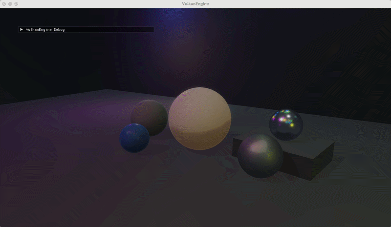
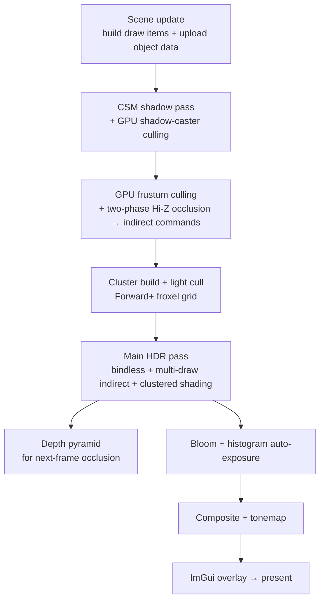

# VulkanEngine

[](https://github.com/ZihanWG/VulkanEngine/actions/workflows/build.yml)
[](https://github.com/ZihanWG/VulkanEngine/actions/workflows/windows-ci.yml)

A **C++20 / Vulkan 1.3 real-time renderer** built as a graphics- and engine-programming portfolio. It pairs explicit GPU ownership with a **GPU-driven** pipeline — bindless materials, multi-draw indirect, compute frustum culling — and **clustered (Forward+) lighting** that scales to hundreds of dynamic lights, plus a render graph, PBR + IBL, cascaded shadows, GPU skeletal animation, HDR post-processing, a per-pass GPU profiler, and an ImGui editor. Everything runs on Dynamic Rendering + Synchronization2.

> Not a full game engine by design. It favors readable Vulkan ownership, clear resource contracts, and small, verifiable milestones — backed by headless unit tests, Linux + Windows CI, and ASan/UBSan runs.

## Demo



*Hundreds of dynamic point/spot lights via clustered (Forward+) shading, with the per-froxel light-count heatmap. Implementation details in [docs/clustered_lighting.md](docs/clustered_lighting.md).*

## Highlights

| Area | What it does |
| --- | --- |
| **GPU-driven** | Bindless material textures, multi-draw indirect batching, compute frustum culling + two-phase Hi-Z occlusion culling (on by default) |
| **Clustered lighting** | 16×9×24 froxel grid built in compute, per-cluster light culling, hundreds of dynamic point/spot lights via Forward+, cluster passes on an async compute queue overlapping the shadow passes |
| **Skeletal animation** | GPU linear-blend vertex skinning from a CPU joint-matrix palette, with a unit-tested animation core (keyframe sampling + hierarchy flatten) |
| **PBR + IBL** | Cook-Torrance GGX, tangent-space normal mapping, prefiltered specular + diffuse irradiance + split-sum BRDF LUT, Kulla-Conty multi-scatter |
| **Shadows** | PCF cascaded shadow maps with per-cascade GPU shadow-caster culling, an indirect shadow path, and an alpha-tested pipeline so cutout casters throw perforated shadows |
| **Post-processing** | HDR scene color, screen-space reflections, ground-truth ambient occlusion (GTAO), mip-chain bloom, histogram auto-exposure, ACES/Reinhard tonemap, motion-vector TAA with reprojected history |
| **Architecture** | Render graph (logical handles + conservative barrier inference), RAII Vulkan RHI, task-parallel frame prep on a job system, per-pass GPU timestamp profiler, ImGui scene/material editor |
| **Engineering** | C++20, Catch2 unit tests, Linux + Windows CI, AddressSanitizer/UBSan, clang-tidy/clang-format |

## Architecture

The renderer is GPU-driven: visibility, light assignment, and shading are decided on the GPU each frame.



Top-level ownership: `Application` → `Window` + `Renderer`; `Renderer` orchestrates the frame and owns subsystems (`ClusteredLighting`, `PostProcessStack`, `RenderGraph`, `GpuProfiler`, `ScreenshotCapture`) over a RAII Vulkan RHI (`src/rhi/`). The full component-ownership breakdown lives in [docs/engine_upgrade_audit.md](docs/engine_upgrade_audit.md); the trade-offs behind these choices are in [docs/design_decisions.md](docs/design_decisions.md). The exact per-frame pass ordering and descriptor-set contract are in [docs/frame_flow.md](docs/frame_flow.md).

## Flagship Subsystems

### Clustered (Forward+) Lighting

The flagship subsystem ([`src/renderer/ClusteredLighting.*`](src/renderer/ClusteredLighting.h)) answers the classic "how do you handle a thousand lights?" question:

1. **Froxel grid** — `cluster_build.comp` computes a per-cluster view-space AABB for a 16×9×24 grid (screen tiles × exponential depth slices), rebuilt from the inverse projection.
2. **Light culling** — `light_cull.comp` transforms each light into view space and tests its bounding sphere against every froxel, writing a compact per-cluster light index list.
3. **Shading** — the main HDR fragment shader resolves its froxel from `gl_FragCoord` + view depth and loops only the lights touching that cluster, reading the grid and index list through buffer-device-address pointers.

A **cluster heatmap** debug view and a brute-force fallback (same light set, every light per fragment) make the win measurable, and the froxel math lives in a GPU-free, unit-tested header (`src/renderer/ClusterGrid.h`). See [docs/clustered_lighting.md](docs/clustered_lighting.md) for the deep-dive and [docs/design_decisions.md](docs/design_decisions.md) for why clustered over deferred or tiled.

### Skeletal Animation

GPU linear-blend vertex skinning (`simple_skinned.vert`) driven by a per-frame joint-matrix palette, fed by a GPU-free, unit-tested animation core (`src/renderer/SkeletalAnimation.h`: keyframe sampling with slerp + skeleton hierarchy flatten). It loads rigged + animated glTF (skins, inverse-bind matrices, animation channels via `GltfSkinnedImport`), with a self-contained procedural bone-chain fallback and playback controls. See [docs/skeletal_animation.md](docs/skeletal_animation.md).

## Feature List

- Vulkan 1.3 initialization with Volk, validation in Debug, Dynamic Rendering, and Synchronization2.
- VMA-backed buffers and images, Buffer Device Address, CPU-visible uploads/readbacks, and GPU-local staging copies.
- SDL3 window and surface integration with swapchain recreation support.
- Static mesh path for built-in cube geometry and static glTF triangle meshes.
- glTF material factors plus base color, normal, metallic-roughness, and emissive texture loading.
- Emissive materials: per-material emissive factor and optional emissive map, added pre-tonemap so emission reads through bloom, editable from the Material Inspector.
- glTF alpha modes: `OPAQUE` and `MASK` cutout, imported from glTF and material JSON. Draw items sort into render buckets by alpha mode, the cutoff rides in the reserved `materialParams.w` slot (negative sentinel disables the test, so no struct or varying growth), and masked casters swap to an alpha-tested shadow pipeline instead of throwing a solid silhouette. See [docs/transparency.md](docs/transparency.md).
- Minimal path-based `AssetManager` for material JSON assets and texture path metadata, with material asset load/save (PBR scalars, texture paths, alpha metadata).
- Tangent-space normal mapping and Cook-Torrance GGX direct lighting, with Kulla-Conty-style multi-scattering compensation.
- Optional HDR environment loading with a procedural fallback, cubemap skybox/IBL, diffuse irradiance, GGX prefiltered specular IBL, and split-sum BRDF LUT.
- Skybox and mesh shaders output HDR linear color into an offscreen scene color target before post-processing.
- Mip-chain bloom (default) with a legacy half-res extract + separable blur fallback, and a final composite pass.
- Optional Temporal AA, disabled by default: Halton subpixel jitter, a main-pass velocity buffer (camera, rigid object, and rotation-only sky motion), history reprojection with closest-depth velocity dilation, conservative neighborhood clamping, ping-pong HDR history, explicit history reset.
- GPU histogram auto-exposure: log-average + histogram luminance reduced into a GPU exposure-state buffer read directly by composite; manual exposure remains as a fallback.
- Screen-space reflections, on by default: the main pass writes a thin G-buffer (octahedral world normal + roughness + metallic), a fullscreen trace marches the depth buffer (jittered start, binary refinement, thickness test) and additively blends fresnel- and confidence-weighted reflections into scene color before TAA.
- Ground-truth ambient occlusion (GTAO), off by default: a half-resolution horizon-search pass reuses the thin G-buffer normal and the depth buffer to integrate the cosine-weighted visibility arc over several slices, a joint-bilateral pass denoises and upsamples it against full-res depth, and the composite multiplies the term into scene color — replacing the former depth-only inline SSAO.
- Reinhard/ACES tone mapping applied in the final composite before swapchain output.
- PCF-filtered cascaded shadow maps (CSM) with texel snapping, optional cascade debug tinting, per-cascade GPU shadow-caster culling, and an indirect shadow draw path.
- Descriptor-indexing path for bindless material texture arrays, with a legacy descriptor-set fallback.
- Render Graph 2.0: logical texture/buffer handles, pass read/write declarations, conservative automatic image transitions, selected buffer barrier inference, transient render targets, pass liveness metadata, and ImGui pass/resource visualization.
- GPU frustum culling compute pass that compacts visible indirect draw commands, with two-phase Hi-Z occlusion culling on by default: phase 1 culls against the previous frame's depth pyramid, a mid-frame rebuild re-tests the occluded candidates, and rescued disocclusions draw in a second load-op main pass — no false negatives, no camera-still restriction.
- Clustered (Forward+) lighting: compute-built 16×9×24 froxel grid, per-cluster GPU light culling, per-froxel point/spot evaluation, heatmap + brute-force toggle, unit-tested froxel math.
- Async compute: ClusterBuild/LightCull run on a dedicated compute queue overlapping the CSM shadow passes — submitted before graphics recording even starts, synchronized by a per-frame semaphore waited at the fragment stage, with concurrent-sharing buffers across queue families and a graphics-queue fallback when no async queue exists.
- Skeletal animation: GPU linear-blend skinning from a per-frame joint-matrix palette, GPU-free unit-tested animation core, rigged/animated glTF import + procedural fallback.
- Multi-draw indirect batching by mesh-compatible ranges on the bindless main path and shadow path.
- GPU timestamp profiler with per-pass timings, frame-latency readback, moving-average ImGui history, and debug labels.
- Task-parallel CPU frame preparation: a unit-tested `JobSystem::parallelFor` spreads the world-bounds cache, per-object frame data, CPU frustum culling, shadow-cascade visibility, and GPU-cull input builds across worker threads, with an A/B toggle and CPU timing readout in the profiler panel.
- Editable scene workflow for runtime object transforms, visibility, camera/light settings, and JSON scene save/load.
- Dear ImGui debug overlay: runtime render settings with JSON persistence, render graph visualization, profiler/frame timeline, culling/exposure history plots, scene hierarchy + material inspector, render-target/CSM cascade debug views.
- Portfolio screenshot capture mode with F12 PNG export from the final tonemapped swapchain image before the ImGui overlay.

## Engineering Focus

- Explicit graphics API design: Vulkan 1.3 object ownership, Dynamic Rendering, Synchronization2, descriptor contracts, and swapchain recreation.
- GPU-driven rendering steps: indirect draws, bindless material textures, GPU frustum culling, default-on two-phase Hi-Z occlusion, and per-pass GPU timing.
- Synchronization and resource lifetime: graph-managed image transitions and selected buffer barriers, explicit readback/intra-pass barriers, frame-latency readbacks, and RAII Vulkan wrappers.
- Debugging/profiling infrastructure: ImGui panels for render graph resources, timestamp scopes, render targets, culling, exposure, materials, and scene metadata.
- Data-driven material workflow: JSON material assets mapped into runtime PBR state without claiming a full editor or asset pipeline.

## Deep Dives

Focused technical write-ups for each major subsystem (start with [docs/README.md](docs/README.md) for the index):

| Topic | Doc |
| --- | --- |
| Architecture, frame flow, current status | [engine_upgrade_audit.md](docs/engine_upgrade_audit.md), [frame_flow.md](docs/frame_flow.md) |
| Design trade-offs (clustered vs deferred, etc.) | [design_decisions.md](docs/design_decisions.md) |
| Clustered (Forward+) lighting | [clustered_lighting.md](docs/clustered_lighting.md) |
| Skeletal animation | [skeletal_animation.md](docs/skeletal_animation.md) |
| Render graph | [render_graph.md](docs/render_graph.md) |
| Screen-space reflections, GTAO | [ssr.md](docs/ssr.md), [gtao.md](docs/gtao.md) |
| Post-processing and TAA | [post_processing.md](docs/post_processing.md), [taa.md](docs/taa.md) |
| GPU culling + Hi-Z occlusion | [gpu_culling.md](docs/gpu_culling.md) |
| GPU profiler | [profiling.md](docs/profiling.md) |
| Asset/material system | [asset_system.md](docs/asset_system.md) |
| Scene editing | [scene_editing.md](docs/scene_editing.md) |
| Portfolio capture | [portfolio_capture.md](docs/portfolio_capture.md) |
| Build (cross-platform / macOS) | [build.md](docs/build.md), [build_macos.md](docs/build_macos.md) |
| Milestone history | [milestones.md](docs/milestones.md) |

## How to Demo

1. Build shaders: `cmake --build build --config Debug --target VulkanEngineShaders`.
2. Build the renderer: `cmake --build build --config Debug --target VulkanEngine`.
3. Run `.\build\Debug\VulkanEngine.exe` (or `./build/VulkanEngine` on macOS/Linux).
4. In `VulkanEngine Debug`, open `Debug Views`, then show the `GPU Profiler`, `Render Graph`, `Scene Hierarchy`, and `Material Inspector` panels.
5. Open the `Lights (Clustered)` panel: drive `Light count` up to a few hundred, toggle `Cluster heatmap`, and toggle `Use clustered culling` off to compare against the brute-force path. Watch the `ClusterBuild` and `LightCull` rows in the `GPU Profiler`.
6. Use `Scene Presets` → `Load Occlusion Test Scene` and watch the `GPU Culling` panel: `Occlusion culled` counts phase-1 rejections and `Phase-2 rescued` counts disocclusions the re-test brought back (two-phase Hi-Z occlusion is on by default).
7. Press `F11` to enable portfolio mode; press `F12` only when intentionally updating the committed portfolio screenshots.

## Build

For detailed cross-platform setup, CMake presets, shader compilation, and CI notes, see [docs/build.md](docs/build.md). For macOS and MoltenVK, see [docs/build_macos.md](docs/build_macos.md).

Required tools:

- CMake 3.25+
- C++20 compiler (Visual Studio 2022 MSVC x64 recommended on Windows)
- Vulkan SDK with headers and `glslc`
- Git for FetchContent fallback dependencies

The CMake project first looks for installed packages. If they are missing, `VULKAN_ENGINE_FETCH_DEPS=ON` downloads SDL3, GLM, Volk, and VMA from pinned release tags. Dear ImGui, `stb_image`, tinygltf, and nlohmann JSON are vendored under `external/`. CMake compiles GLSL shaders into the build-directory shader folder and embeds that path plus the source `assets` path into the executable, so launches do not depend on the working directory.

```powershell
# Windows
cmake -S . -B build -G "Visual Studio 17 2022" -A x64
cmake --build build --config Debug
.\build\Debug\VulkanEngine.exe
```

```sh
# macOS / MoltenVK
source "$VULKAN_SDK/setup-env.sh"
export SDL_VIDEODRIVER=cocoa
cmake -S . -B build-mac -G Ninja -DCMAKE_BUILD_TYPE=Debug
cmake --build build-mac
./build-mac/VulkanEngine
```

macOS is supported through the LunarG Vulkan SDK + MoltenVK for portability and basic validation; the primary showcase platform is RTX/NVIDIA, and some advanced GPU features may be disabled depending on Apple GPU / MoltenVK support. See [docs/build_macos.md](docs/build_macos.md) for the app-bundle target and launcher.

Runtime settings load from `config/runtime_settings.json` when present (user-local, git-ignored; generate it with the ImGui `Save Settings` button). `config/runtime_settings.example.json` documents the format.

## Validated Environment

Validated locally on Windows + Visual Studio 2022 MSVC x64, Vulkan SDK 1.4.328.1, NVIDIA GeForce RTX 3080 Ti Laptop GPU. CI builds on `windows-2022` and `ubuntu-24.04`: it configures CMake, compiles the GLSL shader target through `glslc`, and builds the renderer, but does not run the executable because GPU/display availability is not guaranteed.

## Scope and Known Limitations

This is a rendering/engine portfolio, not a full game engine — no physics, gameplay scripting, full ECS, or production editor. Selected current limitations (full list in [docs/engine_upgrade_audit.md](docs/engine_upgrade_audit.md)):

- `RenderGraph` infers conservative barriers and pass liveness, but is not a production scheduler or memory-aliasing/transient-allocation system; async compute is handled outside the graph (the cluster passes manage their own barriers), not by a multi-queue graph scheduler.
- GPU shadow culling is optional and still uses CPU-built draw items/batches; it is not alpha-tested, occlusion-driven, or BVH-backed.
- CSM uses basic texel snapping, without stable crop matrices, cascade blending, or per-cascade resolution control.
- Two-phase Hi-Z occlusion re-tests candidates against a mid-frame pyramid rebuild, but is object-granularity (AABB screen rects, no per-cluster/meshlet tests) and requires the bindless multi-draw-indirect path.
- Upload paths use one-time command buffers + queue idle waits — fine for init, not ideal for runtime streaming.
- TAA reprojects history along a main-pass velocity buffer, but skinned joint-space motion, disocclusion masks, temporal upscaling, and FSR/DLSS/XeSS are not implemented.
- Screen-space reflections are linear-march (no Hi-Z acceleration or roughness-cone blur) and add on top of IBL specular; no ray tracing, planar reflections, or glass transmission.
- GTAO is applied as a scene-color multiply in the composite (not restricted to indirect/ambient light), has no multi-bounce term (the thin G-buffer stores no albedo) and no temporal accumulation yet; it is spatial half-res + joint-bilateral upsample only.
- glTF import covers static + skinned meshes and base color/normal/metallic-roughness/emissive textures; occlusion textures, morph targets, cameras, and scene lights are future work.
- ImGui is a debug UI only (no docking/editor layout); scene editing is limited to existing runtime objects.
- HDR swapchain output, local exposure, and high-resolution offline capture are not implemented.

## Future Work

- Build mesh batches fully on the GPU and broaden the GPU-driven object/material layout.
- GPU-built shadow batches, alpha-tested shadow casters, shadow LOD, and stronger CSM stabilization.
- BVH/spatial partitioning, LOD, and mesh/task shader experiments.
- Improved HDR environment prefiltering, color-management policy, local exposure, and HDR swapchain output.
- Expanded scene editing (object creation/deletion, hierarchy editing, picking, per-scene settings) and asset tooling (texture import/reload, asset browser, material graph, render graph node view).
- Broader glTF support (alpha modes, occlusion/emissive handling, tangent generation, morph targets, cameras, lights).

## Portfolio and Resume Copy

One-line summary:

> C++20 Vulkan 1.3 real-time renderer featuring clustered (Forward+) lighting, GPU skeletal animation, PBR/IBL, cascaded shadows, HDR post-processing, mip-chain bloom, GPU exposure, a render graph with barrier inference, GPU timestamp profiling, GPU culling with optional Hi-Z occlusion, a TAA foundation, editable scene tools, JSON material assets, and overlay-free portfolio capture.

Resume bullets:

- Built a C++20 Vulkan 1.3 real-time renderer using Dynamic Rendering, Synchronization2, VMA, and Volk.
- Implemented clustered (Forward+) lighting — a compute-built 16×9×24 froxel grid with GPU light culling — scaling to hundreds of dynamic point/spot lights, with a cluster heatmap debug view and unit-tested froxel math.
- Implemented GPU skeletal animation: linear-blend vertex skinning from a per-frame joint-matrix palette, with a unit-tested, GPU-free animation core (keyframe sampling with slerp + skeleton hierarchy flatten).
- Engineered a GPU-driven pipeline: bindless material textures, multi-draw indirect, GPU frustum culling, optional Hi-Z occlusion, and per-pass GPU timestamp profiling.
- Implemented PBR/IBL shading, cascaded shadows, HDR post-processing, mip-chain bloom, and GPU histogram auto-exposure, organized behind a render graph with conservative barrier inference.
- Built editor-style tooling (ImGui scene/material editing, JSON scene save/load, overlay-free capture) and engineering hygiene: Catch2 unit tests, Linux + Windows CI, and ASan/UBSan runs.
